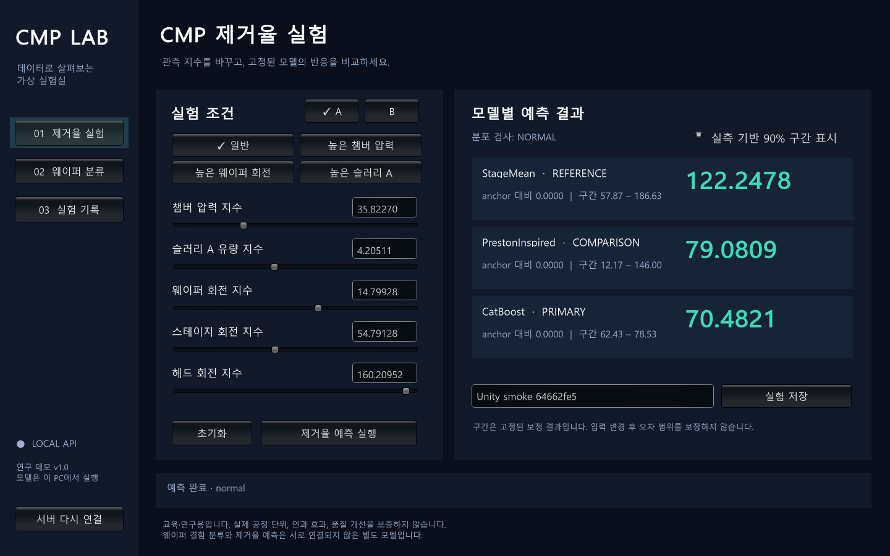

# CMP Virtual Lab ML

PHM 2016 CMP 제거율 예측, WM-811K 단일 결함 분류, MixedWM38 복합 결함 분류를 학습하고 **로컬 API와 Windows Unity 데모**로 연결한 연구 프로젝트입니다. 원본 데이터는 Git에 포함하지 않고 모델·분할·평가 결과와 검증 증거를 보존합니다.

**학습·API·Unity 데모 구현 및 통합 검증은 완료됐습니다.** 제공 범위는 교육·연구 데모이며 제조 공정 배포 승인을 의미하지 않습니다. WM의 lot 간 성능 저하, Mixed의 합성 데이터 계보 부재, PHM 예측구간의 과도한 coverage 등 확인된 한계를 보고서에 명시합니다.

## 데모 실행과 전체 결과

이 PC에서는 `start-demo.cmd`를 실행합니다. 새 PC에서는 Python 3.12 설치 후 `tools/start-demo.ps1 -Setup`을 사용합니다. Windows 실행 파일은 [GitHub Releases](https://github.com/king-beomsoo/cmp-virtual-lab-ml/releases)에서 받아 `builds/CmpDemo/`에 둡니다. **[설치·실행·API 사용 안내](docs/run-demo.md)**를 참고하세요.

| 작업 | 완료 결과 | 보고서 |
|---|---|---|
| PHM CMP | Stage별 13종, 총 26개 학습·추가 검증 | [기존 평가](runs/phm_cmp_v1/REPORT.md), [외부 분할](runs/phm_cmp_external_v1/REPORT.md) |
| WM-811K | Test 118,581개, macro F1 **0.7204**, 정확도 **94.93%** | [분류 보고서](runs/wm811k_v1/REPORT.md) |
| MixedWM38 | Test 7,582개, macro F1 **0.9902**, 조합 일치율 **97.94%** | [복합 결함 보고서](runs/mixedwm38_v1/REPORT.md) |
| 서비스 | 원시 시계열·시나리오·웨이퍼 추론, OOD 차단, 실험 저장·조회·내보내기 | [운영 검증](runs/service_v1/REPORT.md) |
| Unity | 전용 프로젝트·Windows 빌드·실제 HTTP 통합 검사 | [프로젝트](unity/CmpDemo), [통합 검사](runs/service_v1/smoke.json) |



학습과 평가에 사용하지 않은 사용자 조작용 합성 맵 편집기를 포함합니다. 실제 데이터는 API로 넣을 수 있습니다. MRR 모델과 웨이퍼 분류 모델 사이에 인과 연결을 학습한 것은 아닙니다. API는 `127.0.0.1:8765`의 로컬 서비스이며 외부 공개 배포를 설정하지 않았습니다.

분류 학습 재현 명령은 아래와 같습니다. 새 디렉터리에서 시작해도 이미 공개된 Test에 맞춰 튜닝하면 새 독립 평가가 되지는 않습니다. 게시된 run은 덮어쓰지 않습니다.

```bash
python tools/fetch_wafer_data.py wm811k
python tools/fetch_wafer_data.py mixedwm38
python -m cmp_ml.wafer_data wm811k --run-dir runs/my_wm
python -m cmp_ml.wafer_train --run-dir runs/my_wm --device cuda
python -m cmp_ml.wafer_verify --run-dir runs/my_wm
python -m cmp_ml.wafer_report --run-dir runs/my_wm
# MixedWM38도 dataset=mixedwm38, 별도 run 경로로 같은 순서 실행
```

분류는 PyTorch를 추가로 사용합니다. CPU 서비스 설치는 `requirements-service.lock.txt`, GPU 학습 설치는 공식 PyTorch cu128 인덱스를 사용합니다. 저장된 CNN 가중치는 `weights_only=True`로 읽으며 API는 업로드된 pickle/joblib을 실행하지 않습니다.

## 결과 보기

- [실험 보고서](runs/phm_cmp_v1/REPORT.md)
- [선정 모델 요약](runs/phm_cmp_v1/selected_summary.csv)
- [전체 모델 비교표](runs/phm_cmp_v1/model_comparison.csv)
- [학습 데이터 검사](runs/phm_cmp_v1/data_audit.json)
- [고정 분할 목록](runs/phm_cmp_v1/split_manifest.csv)
- [선정 모델·모델 해시](runs/phm_cmp_v1/selection.json)
- [저장 모델 재현 검증](runs/phm_cmp_v1/verification.json)
- [학습된 모델 26개](runs/phm_cmp_v1/models)
- [Stage B 학습 데이터 중첩 교차검증](runs/phm_cmp_stage_b_stability_v1/REPORT.md)
- [이전에 사용하지 않은 PHM 분할 평가](runs/phm_cmp_external_v1/REPORT.md)

보고서의 선정 모델은 **Validation MAE**로 정했습니다. Test 결과를 본 뒤 모델이나 설정을 다시 선택하지 않습니다. 모든 모델의 MAE·RMSE·R², Chamber route별·그룹별 평가, 예측구간 실측 coverage를 남깁니다.

| Stage | 검증에서 선정한 모델 | Test MAE | Test RMSE | Test R² |
|---|---|---:|---:|---:|
| A | CatBoost | 2.8164 | 3.6262 | 0.9888 |
| B | Physics+CatBoost | 4.6455 | 5.6180 | 0.1774 |

**결과 해석:** 극단 제거율 4건이 모두 Train에 배치되어 이번 Test는 극단값 예측 성능을 검증하지 않습니다. Stage A의 평균 기준선은 이 값들의 영향을 크게 받습니다. Stage B는 Test에서 RandomForest 등 단독 ML이 검증 선정 Hybrid보다 낮은 오차를 냈으며, 이번 결과로 Hybrid 우월성을 주장하지 않습니다. 보정 그룹은 A 1개·B 2개로 적고, A의 예측구간 coverage 96.55%는 명세의 85–95% 범위를 벗어납니다. 다음 개선 실험에는 새 평가 설계가 필요합니다.

## Stage B 추가 안정성 검증

기존 Stage B **Train 489개 표본·31개 연결 그룹** 안에서 바깥 5개 구간, 안쪽 3개 구간의 중첩 그룹 교차검증을 완료했습니다. 8개 모델군·25개 설정 후보를 비교하며, 각 바깥 구간의 모델과 설정은 해당 구간을 제외한 내부 검증으로만 골랐습니다. 결합 모델의 잔차도 각 학습 구간 안에서 별도로 그룹 교차검증해 만들었습니다.

내부 검증으로 모델을 선택하는 절차의 **OOF MAE는 3.5636, RMSE는 4.4774, R²는 0.7182**입니다. 선택 빈도는 XGBoost 2회·CatBoost 2회·RandomForest 1회였습니다. 단독 ML 4종의 MAE는 3.3887–3.4123으로 가까웠고, 결합 모델은 4.6515–4.8101로 더 컸습니다. 이번 설정 범위에서는 결합 모델의 이점을 확인하지 못했습니다. 후보 적합 375회와 바깥 모델 적합 40회를 수행했고, 저장 체크포인트 5개 및 기존 v1 파일 보존 검증을 통과했습니다.

이 결과는 v1 결과를 본 뒤 시작한 **개발 데이터 안정성 진단**입니다. v1 Validation·Calibration·Test는 적합·선택·점수 계산에 사용하지 않고, 기존 v1 모델·평가 파일을 유지합니다. 새로운 독립 Test 성능이나 배포 모델의 성능 개선을 뜻하지 않습니다. [보고서](runs/phm_cmp_stage_b_stability_v1/REPORT.md), [전체 점수](runs/phm_cmp_stage_b_stability_v1/summary.csv), [분할·누수 검사](runs/phm_cmp_stage_b_stability_v1/partition_audit.json), [모델 선택과 실행 완료 검증](runs/phm_cmp_stage_b_stability_v1/completion.json)을 확인하세요.

```bash
python -m cmp_ml.cli stability --source-run runs/phm_cmp_v1 --output-dir runs/my_stage_b_stability --threads 4
python -m cmp_ml.stability_report --run-dir runs/my_stage_b_stability
```

실행에는 원본으로 준비한 로컬 `runs/phm_cmp_v1/features.csv.gz`가 필요합니다. 완료된 출력 폴더는 덮어쓰지 않습니다. 추가 결과의 모델 체크포인트 5개는 바깥 구간별 검증용이며 배포 모델이 아닙니다.

## 이전에 사용하지 않은 PHM 분할 평가

PHM 2016의 별도 test·validation 시계열 370개와 정답 848개를 공개 보관본에서 확보했습니다. 기존 데이터의 웨이퍼·파일 연결 그룹과 겹치는 표본을 제외하고 **test 121개, validation 140개**를 평가했습니다. 보관본의 학습 파일 186개는 기존 파일과 바이트 단위로 일치하며, 다운로드 버전과 해시를 기록했습니다.

| 새 평가 구분 | Stage | 기존 선정 모델 | 평가 표본 | MAE | RMSE | R² |
|---|---|---|---:|---:|---:|---:|
| test | A | CatBoost | 89 | 2.3131 | 3.0954 | 0.9940 |
| test | B | Physics+CatBoost | 32 | 2.7250 | 3.3803 | 0.8955 |
| validation | A | CatBoost | 72 | 2.5815 | 3.5518 | 0.9914 |
| validation | B | Physics+CatBoost | 68 | 3.0103 | 3.7650 | 0.8168 |

이 점수는 **중복을 제외한 부분집합**의 결과입니다. 모델·예측·제외 기준을 정답 조회 전에 고정했고, 기존 모델을 재학습하거나 새 점수로 다시 선정하지 않았습니다. 같은 2016 데이터의 수집 시기가 겹치는 평가이므로 새 공장이나 미래 생산 환경을 검증한 것은 아닙니다. 기존 Test 점수와의 차이를 학습에 의한 성능 개선으로 해석하지 마세요. [전체 비교·제외 내역·출처·한계](runs/phm_cmp_external_v1/REPORT.md)를 확인하세요.

재현은 아래 순서로 진행합니다. `--original-root`에는 기존 원본 CMP1 폴더를 지정하고, 출력 경로는 비어 있어야 합니다. 원본과 특징표는 `data/` 또는 Git에서 제외되는 경로에 둡니다. 정답 다운로드는 예측 고정 이후에만 허용합니다.

```bash
python -m cmp_ml.external freeze --source-run runs/phm_cmp_v1 --run-dir runs/my_external
python tools/fetch_phm_external.py index --data-dir data/phm2016_external --run-dir runs/my_external --original-root /path/to/CMP1
python tools/fetch_phm_external.py traces --data-dir data/phm2016_external --run-dir runs/my_external
python -m cmp_ml.external predict --source-run runs/phm_cmp_v1 --data-dir data/phm2016_external --run-dir runs/my_external
python tools/fetch_phm_external.py labels --data-dir data/phm2016_external --run-dir runs/my_external
python -m cmp_ml.external score --source-run runs/phm_cmp_v1 --data-dir data/phm2016_external --run-dir runs/my_external
python -m cmp_ml.external_verify --source-run runs/phm_cmp_v1 --run-dir runs/my_external
python -m cmp_ml.external_report --run-dir runs/my_external
```

## 모델

| 모델군 | 비교 모델 |
|---|---|
| 평균 기준선 | GlobalMean, StageMean |
| 선형 | Ridge, PLS |
| 기존 비교 모델 | KNN, SVR, RandomForest |
| 물리 관계 참고 모델 | PrestonInspired |
| 부스팅 | CatBoost, XGBoost, LightGBM |
| 결합 | Physics+CatBoost, Physics+LightGBM |

GlobalMean은 전체 Train의 평균이며 StageMean은 해당 Stage Train의 평균입니다. 나머지 모델은 Stage별로 독립 학습합니다. 작은 고정 탐색 범위를 쓰는 첫 실험이며, 모델군마다 탐색 횟수가 같거나 최적 성능을 보장하는 비교는 아닙니다. [탐색 결과](runs/phm_cmp_v1/candidate_trials.json)와 [선정 설정](runs/phm_cmp_v1/selected_hyperparameters.json)을 함께 확인하세요.

## 데이터와 누수 방지

입력 디렉터리 구조:

```text
CMP1/
  CMP-training-removalrate.csv
  CMP-data/
    training/
      CMP-training-000.csv
      ...
      CMP-training-184.csv
```

- 원본 시계열 185개 파일, 672,744행, 25개 컬럼과 정답 1,981건을 검사합니다.
- 원본 CSV는 수정하지 않습니다. 파생 데이터에서만 정확히 동일한 측정 행을 제거하며, 빈 파일·중복 시각·파일 간 표본 분산을 기록합니다.
- `(WAFER_ID, STAGE)`를 최종 표본 키로 사용합니다. 같은 키가 여러 파일에 있으면 장비 ID와 시간 범위를 검사하고, 출처 파일 목록을 보존합니다.
- 같은 웨이퍼의 A·B 기록 및 해당 웨이퍼들이 공유하는 파일을 전이적으로 묶습니다. **웨이퍼·파일·연결 그룹이 split 사이에 겹치지 않습니다.**
- 목표 비율은 Train 60% / Validation 15% / Calibration 10% / Test 15%입니다. seed 20260903으로 500개 그룹 배치 후보를 비교하며 제거율 값은 보지 않습니다. Stage 비율 오차는 5 percentage point 이내, 보정 표본은 Stage별 80건 이상입니다.
- 이는 그룹을 분리한 무작위 holdout입니다. 미래 생산 시점, 새로운 장비 또는 새로운 공정의 성능을 검증한 시간순 테스트는 아닙니다.
- 식별자·파일명·절대 시각·정답은 예측 특징에서 제외합니다. 시간은 표본 내부 경과량과 특징 계산에만 사용합니다.
- 각 센서의 평균·표준편차·극값·처음/끝·범위·기울기·AUC·0 비율과 Chamber별 특징을 만듭니다. 동일 시각의 센서는 평균, 상태는 안정 정렬 후 마지막 값을 사용합니다.
- 60 source timestamp units를 넘는 공백은 AUC/관측시간에 포함하지 않습니다. 공백 수와 전체 경과시간은 별도 특징입니다. 실제 초·압력·유량·회전·MRR 단위를 임의로 붙이지 않습니다.
- 특징 스키마·결측 대체값·상수 제거·정규화는 Train에서만 적합합니다. Train에 없던 Chamber는 오류로 처리합니다.
- 알려진 극단 제거율 4건을 Train이나 주 평가에서 삭제하지 않습니다. 별도 민감도 표는 진단용이며 주 성능을 대체하지 않습니다.

[v0.4.0 명세와 실제 데이터의 조정 사항](docs/protocol-decisions.md)을 참고하세요.

## 실행

Python **3.12**를 사용합니다. 아래 명령은 저장소 최상위에서 실행합니다. 운영체제에 맞게 가상환경을 활성화하세요.

```bash
python -m venv .venv
# Windows PowerShell: .venv/Scripts/Activate.ps1
# Linux/macOS: source .venv/bin/activate
python -m pip install -r requirements.lock.txt
python -m pip install -e . --no-deps
python -m pytest -q
```

데이터는 사용자가 적법하게 확보한 원본을 로컬에 둡니다. 원본 데이터와 파생 전체 특징표는 Git에 포함하지 않습니다. [PHM 공식 페이지](https://phmsociety.org/conference/annual-conference-of-the-phm-society/annual-conference-of-the-prognostics-and-health-management-society-2016/phm-data-challenge-4/)를 출처로 사용하며, 포함된 파일 해시로 사용 데이터 버전을 확인할 수 있습니다.

```bash
python -m cmp_ml.cli prepare --data-root /path/to/CMP1 --run-dir runs/my_run
python -m cmp_ml.cli train --run-dir runs/my_run --threads 4
python -m cmp_ml.cli evaluate --run-dir runs/my_run
python -m cmp_ml.cli verify --run-dir runs/my_run
python -m cmp_ml.cli report --run-dir runs/my_run
```

`prepare`는 기존 분할을 덮어쓰지 않으며, `train`은 모델 선정이 끝난 실행을 덮어쓰지 않습니다. `evaluate`는 실행 시작 전에 봉인 파일을 기록하고, 같은 실행의 테스트 재평가를 차단합니다. 중단된 평가도 봉인 상태로 남습니다. 이를 삭제해 재튜닝하지 마세요. 새로운 연구 실험은 새 holdout이나 nested group evaluation을 설계해야 하며, 단순히 새 폴더 이름을 사용하는 것으로 평가 독립성이 회복되지는 않습니다.

게시된 v1은 이미 평가가 완료된 실행입니다. 원본으로 동일 분할을 다시 만드는 재현 실험은 가능하지만, 같은 Test에 대한 추가 튜닝 결과를 새로운 독립 평가로 보고하면 안 됩니다. 저장된 모델만 이용할 경우 보고서·예측 CSV를 그대로 열어볼 수 있습니다.

## 모델 불러오기

학습 환경 버전을 맞춘 뒤 이 저장소에서 생성한 모델만 읽습니다. 입력은 `prepare`가 만든 wafer-stage 특징 행입니다. Raw 센서 1행을 직접 입력하는 API는 아닙니다.

```python
from pathlib import Path
import joblib
import pandas as pd

run = Path("runs/phm_cmp_v1")
frame = pd.read_csv(run / "features.csv.gz")  # 원본 데이터로 prepare한 로컬 파일
bundle = joblib.load(run / "models" / "A_StageMean.joblib")
samples = frame[frame.STAGE.eq("A")].head(3)
prediction, lower, upper = bundle.predict_interval(samples)
```

## 해석 범위

- PrestonInspired는 wafer-load 압력·회전·슬러리·누적 사용량의 **데이터셋 지수**에 적합한 경험적 모델입니다. PRESSURIZED_CHAMBER_PRESSURE를 실제 웨이퍼 접촉 압력으로 취급하지 않습니다.
- 회전의 기하·실제 속도·물리 단위가 없으므로 진짜 상대속도나 Preston 계수를 추정했다고 주장하지 않습니다. Slurry A/B/C는 별도 항으로 유지합니다.
- Hybrid의 잔차 타깃은 Train 내부의 그룹별 out-of-fold 물리 예측으로 만듭니다. 최종 물리 모델은 전체 Train으로 적합합니다.
- 90% 예측구간은 별도 Calibration 표본의 잔차 순위로 만듭니다. 그룹 내부 상관 때문에 표본 교환가능성을 가정한 공식적인 coverage 보장은 없으며, 실제 Test coverage와 구간 폭을 보고합니다.
- 음수 예측은 주 점수 계산에서 몰래 0으로 바꾸지 않고 개수를 보고합니다. 현재 결과는 모델 비교용이며 UI 입력 반응·OOD·모든 릴리스 조건을 검증한 배포 승인이 아닙니다.
- WM-811K·MixedWM38과 PHM을 동일 웨이퍼로 연결한 근거가 없으므로 공정 조건에서 결함맵을 생성·예측하는 모델은 포함하지 않습니다.
