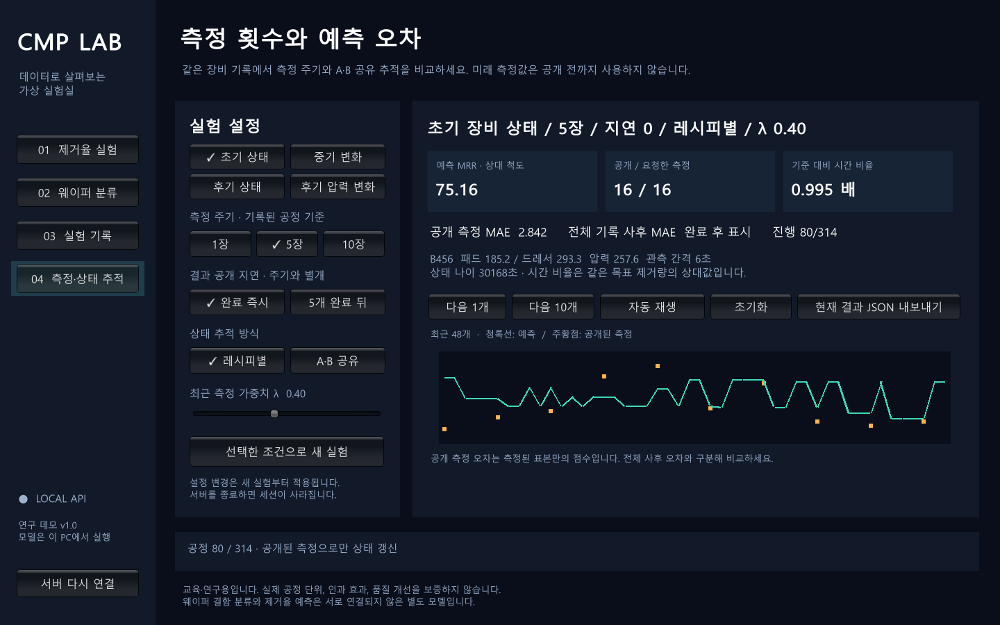
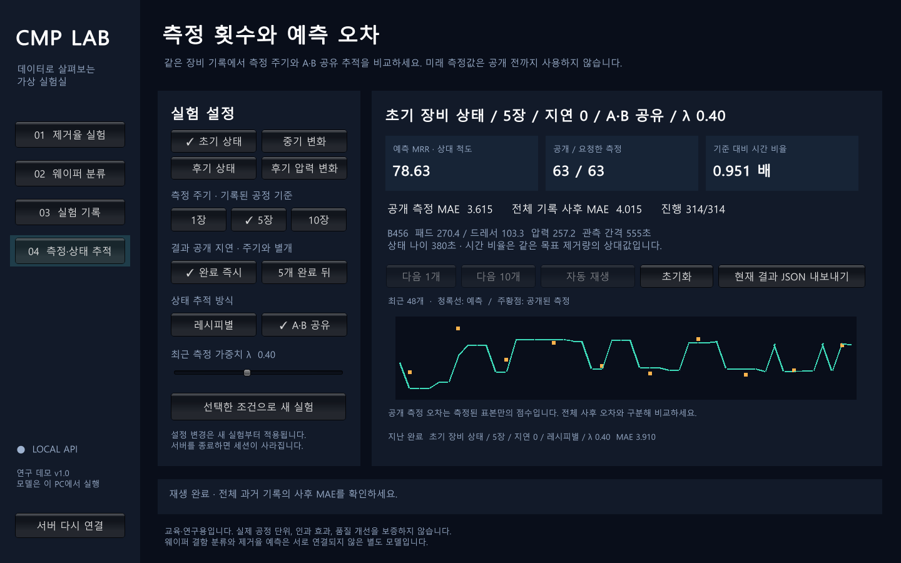

# 측정·상태 추적 Unity 데모

2026-09-29. 측정 주기 실험의 동일한 이벤트 추적 로직을 로컬 HTTP API와 Unity Windows 화면에 연결했습니다. 측정 주기 1/5/10, 공개 지연 0/5, 레시피별/A·B 공유, 최근 측정 가중치 λ를 변경할 수 있습니다. 장비 상태는 실제 과거 기록의 네 시간 구간을 선택하는 방식입니다. [실험 전체 결과](../phm_cmp_measurement_cycles_v1/README.md), [실행 안내](../../docs/run-demo.md).

## 실험 결과를 읽는 방법

같은 시간순 평가 목록과 같은 측정 횟수에서 비교했습니다. 아래는 네 fold와 주기별 모든 시작 위치를 평균한 전체 기록 MAE입니다. 즉시 공개 조건입니다.

| 측정 주기 | 레시피별 | A/B 공유 | 공유의 MAE 변화 |
|---|---:|---:|---:|
| 1개마다 | 2.9644 | 3.3735 | 13.80% 증가 |
| 5개마다 | 3.6616 | 3.8406 | 4.89% 증가 |
| 10개마다 | 4.1740 | 4.1617 | 0.29% 감소 |

10개 주기에서도 네 시간 구간 중 두 구간은 공유가 더 나쁩니다. 시작 위치별 차이도 양·음이 모두 있으므로 작은 평균 개선을 일반적인 우월성으로 판단하지 않습니다. 지연 5 조건에서도 평균 개선은 10개 주기의 0.39%뿐이었습니다. 이번 근거로 공유 추적을 기본 방식으로 채택하지 않았고 UI 기본값은 레시피별·주기 1·지연 0·λ=0.4입니다.

UI는 매 n번째 공정을 측정하는 시작 위치(offset=n−1)와 **선택한 단일 fold**를 표시합니다. 따라서 화면 숫자는 위의 모든 시작 위치·fold 평균과 다릅니다. 실제 실행 검사에서는 초기 구간(fold 2), 주기 5, 지연 0, λ=0.4, 314개 평가 기록과 63개 측정으로 별도 MAE **3.909578**, 공유 MAE **4.015436**이 나왔습니다. 특정 화면만 보고 전체 결과를 판단하지 마세요.

## 교육 화면

진행 화면은 공개된 측정값만 주황점으로 표시하고, 미래/미측정 정답은 전송하지 않습니다. 전체 정답으로 계산한 사후 MAE는 재생이 끝나야 표시됩니다. 공개 측정 MAE는 그때까지 실제로 측정된 일부 표본의 오차입니다. 두 점수는 서로 다른 표본을 평가합니다.



새 실험을 만들면 지난 완료 결과 두 개를 비교용으로 남깁니다. λ를 포함한 실제 적용 설정을 제목과 지난 결과에 표시합니다. 설정 패널 변경은 다음 새 실험부터 적용됩니다. 전체 기록은 JSON으로 내보낼 수 있습니다.



예측 MRR은 데이터의 상대 척도입니다. 시간 비율은 동일 목표 제거량에 대해 `학습 레시피 기준 MRR / 현재 예측 MRR`로 계산합니다. 물리적인 초 단위 연마 시간이 아니며, 압력·소모품의 임의 조작 효과는 모델링하지 않습니다. A456/B456의 같은 테이블 기록을 공유하며 A123은 제외합니다. 테이블 공유가 패드 교체 구간의 완전한 식별이나 공통 상태 가정의 정확성을 입증하는 것은 아닙니다.

## 실제 실행 검증

- 전체 Python 테스트 **185개 통과**, 기존 경고 4개. 미래 값 비참조, 배치 크기 불변, 지연/미측정 정답 비공개, 동일 웨이퍼의 이미 공개된 A→B 참조를 검사했습니다.
- HTTP 서버의 **48개 기본 시작 위치 조건 / 15,432개 평가**를 봉인된 연구 지표와 대조했습니다. MAE/RMSE 최대 차이 **8.89×10⁻¹⁶ 이하**이며 측정 횟수도 일치합니다. 모든 조건에서 오래된 revision 거절, 내보내기 일치, 진행 중 정답 비공개를 검사했습니다. [HTTP 검증](http-verification.json).
- Unity **6000.3.21f1 / Windows x64 / Mono** 빌드 성공. 실제 실행 파일에서 생성→80개 진행→초기화→314개 완료→공유 방식 재실행→기존 Stage A 추론을 확인했습니다. [추적 통합 검사](unity-replay-smoke.json).
- 기존 Stage A/B 예측, WM-811K/MixedWM38 분류, 저장·목록 조회도 같은 실행 파일의 별도 검사로 통과했습니다. [기존 기능 검사](legacy-smoke.json).
- [빌드·테스트·실행 파일 정보](validation.json), [Windows ZIP 정보](windows-package.json), [파일·소스 해시](completion.json).

API는 `/api/v2/state-scenarios`, `/api/v2/state-sessions`의 생성·조회·advance·reset·export·delete를 제공합니다. 변경 요청은 `expected_revision`으로 중복/경합을 거절하며, 하나의 세션에 같은 측정이 두 번 적용되지 않습니다. 서버 메모리의 최대 32개 세션이며 재시작 시 사라집니다. UI는 새 실험을 만들 때 이전 세션을 닫습니다. 연구 결과에는 기존 서비스의 학습 모델 교체가 포함되지 않습니다.

```powershell
# 설치/빌드는 docs/run-demo.md 참고
.\tools\start-demo.ps1 -Port 8767
# 실행 중인 API를 연구 결과와 대조
python tools/verify_measurement_demo.py --port 8767 --output .cache/http-recheck.json
```

Windows ZIP은 이 PC의 `output/CMP-Unity-Measurement-Demo-v1.zip`에 만들었으며 GitHub 실행 파일 릴리스로 게시하지 않았습니다. GitHub에는 소스·Unity 프로젝트·실험 결과·위 화면을 올립니다. ZIP은 Python 서버/모델을 포함하는 독립 설치 프로그램이 아니므로 저장소와 실행 안내를 함께 사용해야 합니다.

친구의 `kp_model.py`, `fit_kp.py`가 아직 없어 문서의 **MAE 2.63 모델은 미비교**입니다. 같은 초기 이력·측정 주기·공개 지연·평가 목록으로 대조한 뒤 최종 모델 선정을 보완해야 합니다.
