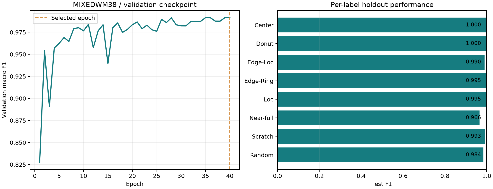

# MixedWM38 복합 결함 분류 학습·평가 보고서

완료: 2026-09-16T12:49:36.454858+00:00

**Test macro F1 0.9902**, 8개 라벨의 조합 전체 일치율 **97.94%** (n=7,582).

## 데이터·분할

학습 22,746, 검증 3,791, 확률 신뢰도 점검용 Calibration 3,791, Test 7,582개입니다.

입력은 정상 die 포함 유효 영역과 불량 die 영역의 두 채널입니다. 종횡비를 유지하여 BOX 방식으로 64×64에 맞추고 빈 영역을 채웁니다. 0/1/2 이외 픽셀과 유효 die가 없는 입력은 거부합니다.

같은 변환 입력 및 회전·반전한 입력을 해시로 묶고 split 사이에 겹치지 않게 했습니다. 라벨이 충돌하는 동일 입력은 제외합니다. 원본 이미지의 모든 유사성, 약간 이동된 이미지, 합성 이미지의 공통 부모까지 독립성을 보장하지는 않습니다.

제작자 연결 Kaggle 사본과 함께 제공된 Description.pdf를 확인했습니다. 수정된 라벨 순서는 Center, Donut, Edge-Loc, Edge-Ring, Loc, Near-full, Scratch, Random입니다. 3중 결함 12개 조합 중 Center+Edge-Loc+Scratch는 2,000개이므로 3중 표본은 13,000개입니다.

문서에 없는 픽셀값 3이 있는 105개(Random 97개, Near-full 8개)는 원본을 수정하지 않고 학습·평가에서 제외했습니다. 유효 37,910개 중 동일 입력 해시 그룹은 36,890개입니다. 데이터에는 GAN 합성 표본이 포함되지만 원본/합성 구분과 부모/lot 식별자가 없어 독립된 실제 공장 성능을 뜻하지 않습니다.

## 학습과 모델 선택

CNN은 24→48→96채널의 세 블록과 공간 위치를 남기는 4×4 출력, 192개 은닉 유닛으로 구성했습니다. 사전에 CNN 모델군을 정하고 Validation macro F1로 체크포인트만 선택했습니다. 비교용 공간 특징 Logistic Regression과 Train 분포 기준선도 저장했습니다.

40 epoch 한도에서 40회를 실행했고 **epoch 40**을 선택했습니다. AdamW, 초기 학습률 0.001, batch 256, cosine schedule, 학습 시에만 회전·반전을 적용했습니다. seed는 20260916입니다.

WM은 제곱근 역빈도 가중 cross entropy, Mixed는 양성 가중치를 최대 30으로 제한한 binary cross entropy를 썼습니다. Mixed의 라벨별 문턱값은 체크포인트 선택 후 Validation에서 0.15–0.85 후보로 결정했습니다. Test 결과로 모델·문턱값을 바꾸지 않았습니다.

| 모델 | Test macro F1 | Test 정확도/조합 일치율 |
|---|---:|---:|
| WaferCNN | 0.9902 | 97.94% |
| SpatialLogistic | 0.8574 | 20.32% |
| TrainPrior | 0.0835 | 2.64% |

## 결함별 Test 결과

| 결함 | 표본 | Precision | Recall | F1 |
|---|---:|---:|---:|---:|
| Center | 2,600 | 1.0000 | 1.0000 | 1.0000 |
| Donut | 2,400 | 1.0000 | 1.0000 | 1.0000 |
| Edge-Loc | 2,600 | 0.9942 | 0.9850 | 0.9896 |
| Edge-Ring | 2,400 | 0.9917 | 0.9983 | 0.9950 |
| Loc | 3,600 | 0.9955 | 0.9936 | 0.9946 |
| Near-full | 28 | 0.9333 | 1.0000 | 0.9655 |
| Scratch | 3,800 | 0.9934 | 0.9924 | 0.9929 |
| Random | 154 | 0.9686 | 1.0000 | 0.9840 |

## 신뢰도·재현성

Test score의 10-bin ECE는 0.000649입니다. Mixed는 0.5 기준 이진 판단을 전체 라벨에 모아 계산했습니다. 서비스는 점수를 **보정된 확률**로 표시하지 않습니다. Calibration 분할은 신뢰도 진단에만 사용하며 별도 확률 보정은 하지 않았습니다.

저장 가중치 CPU 반복 호출 차이는 0.0e+00이며, TF32를 끈 GPU와 CPU의 Validation 512개 최대 logit 차이는 1.14e-05입니다. 원래 GPU TF32와 CPU의 이 표본 결정 차이는 0개입니다. Test 점수는 최초 GPU 평가값이며 이 부분집합 검사로 전체 CPU Test 점수의 완전 일치를 주장하지 않습니다.

최초 학습은 첫 역전파에서 CUDA adaptive average pooling의 결정론 지원 문제로 중단되었습니다. 같은 8→4 평균 계산을 하는 고정 pooling으로 교체하고, epoch·가중치·holdout 평가가 생기기 전에 재개했습니다. 최종 CPU/GPU 검사에서는 TF32 차이를 발견하여 FP32 비교를 별도로 수행했습니다. 학습·선택·Test 결과는 변경하지 않았으며 recovery.json과 verification.json에 기록했습니다.

실제 학습 코드 바이트는 code_snapshot/에 보존했습니다. 현재 소스의 후속 유지보수는 source_id 압축 해제 캐싱과 최종 CPU/GPU 검사 방식 수정이며, 게시된 가중치나 점수를 재생성하지 않았습니다.

## 출처와 해석 범위

[WM-811K 원 출처](https://mirlab.org/dataSet/public/), [WM Kaggle 사본](https://www.kaggle.com/datasets/qingyi/wm811k-wafer-map), [Mixed 제작자](https://github.com/Junliangwangdhu/WaferMap), [Mixed 제작자 연결 사본](https://www.kaggle.com/datasets/co1d7era/mixedtype-wafer-defect-datasets). 파일별 SHA-256과 다운로드 시각은 source_provenance.json에 있습니다. 원본 데이터는 Git에 포함하지 않습니다.

이 모델은 불량 die의 공간 패턴을 분류합니다. PHM CMP 제거율 데이터와 동일 웨이퍼로 연결된 근거가 없으므로 공정 조건→결함 맵 예측이나 공정 제어 모델이 아닙니다. 인간 사용자 연구, 새 공장 데이터 검증, 실제 제조 공정 배포 승인은 수행하지 않았습니다.
