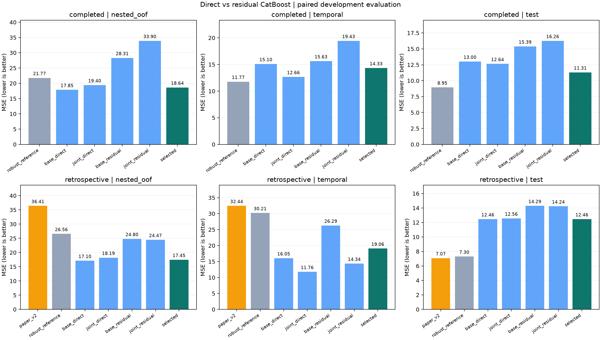

# P2 다중 구간·CatBoost 직접/잔차 실험 v3

이전 robust v2의 남은 오차를 바탕으로 학습 특징과 모델을 바꾼 후속 개발 실험이다.
모든 논문 baseline과 기존 결과를 보존했고 API/Unity 모델은 교체하지 않았다.
이전 공식 Test/Validation과 바깥 fold를 이미 보았으므로 **새 독립 검증이 아니다**.

**이번 후보는 기존 모델을 대체하지 않는다.** 완료된 과거 이력 조건의 선택 절차는 그룹 검증 MSE를
21.7694 → **18.6431 (14.36% 감소)**로 낮췄지만, 시간순은 11.7714 → **14.3296**,
기존 Test는 8.9491 → **11.3107**로 악화됐다. 논문 비교 조건의 기존 Test 최고값 **7.0743**도
새 선택 절차 **12.4615**보다 좋다. 좋지 않은 결과까지 그대로 보존했다.

Cond2의 그룹 검증 MSE는 26.6775 → **19.0245**로 줄었으나 시간순 12.8110 → **19.1492**,
Test 8.7258 → **14.1092**로 나빠졌다. completed 최종 선택에서 Cond1/3은 기존 모델,
Cond2는 새 base_direct였으므로 공식 Test 악화는 이 Cond2 교체에서 발생했다.

예상했던 잔차 보정은 이번 설정에서 직접 예측보다 전반적으로 불리했다.
401개 특징의 결합도 일관된 우위를 보이지 않았다. 그룹 검증에서 유리한 선택이 이후 시간과 공식 Test에
그대로 이어지지 않았다는 관찰이며, 분포 변화·이력 밀도·모델 편향 중 원인이 무엇인지는 확정하지 않는다.
다음 개발에서는 **여러 시점의 시간순 내부 검증으로 모델을 선택하는 절차**를 우선 점검할 필요가 있다.
이 문장은 다음 실험 제안이며 이번 결과를 보고 후보를 재선정한 것은 아니다.

## 같은 조건에서의 비교

| evaluation | policy | reference | reference_mse | selected_mse | mse_reduction_percent |
|---|---|---|---|---|---|
| nested_oof | completed | robust_reference | 21.7694 | 18.6431 | 14.3612 |
| nested_oof | retrospective | paper_v2 | 36.4062 | 17.4479 | 52.0743 |
| temporal | completed | robust_reference | 11.7714 | 14.3296 | -21.7321 |
| temporal | retrospective | paper_v2 | 32.4365 | 19.0647 | 41.2246 |
| test | completed | robust_reference | 8.9491 | 11.3107 | -26.3893 |
| test | retrospective | paper_v2 | 7.0743 | 12.4615 | -76.1511 |
| validation | completed | robust_reference | 8.5402 | 8.9916 | -5.2851 |
| validation | retrospective | paper_v2 | 6.8277 | 11.7691 | -72.3730 |

MSE 감소율은 상대 변화이며 정확도나 오차율 그 자체가 아니다. 양수는 개선, 음수는 악화다.
`completed`는 완료된 Train 공정의 이력만 쓰되 즉시 계측을 가정한다. `retrospective`는 미래 Train 이웃을 허용하는
이전 논문 비교 조건이다. 두 정책이나 표본 구성이 다른 평가의 숫자를 섞어 순위를 매기지 않는다.
[대응 차이의 재표집 구간](paired_effects.csv)은 고정 예측의 파일 연결 그룹 재표집이며, 독립 확인 검정이 아니다.

## 전체 MSE와 후보 선택

| policy | model | nested_oof | temporal | validation | test |
|---|---|---|---|---|---|
| completed | base_direct | 17.8493 | 15.0955 | 11.7129 | 13.0045 |
| completed | base_residual | 28.3099 | 15.6289 | 13.8031 | 15.3876 |
| completed | history_anchor | 67.4161 | 24.4379 | 16.6295 | 17.9339 |
| completed | joint_direct | 19.4003 | 12.6610 | 11.7696 | 12.6424 |
| completed | joint_residual | 33.9005 | 19.4309 | 14.6903 | 16.2567 |
| completed | previous_control | 22.4289 | 12.4201 | 8.9955 | 9.3458 |
| completed | robust_reference | 21.7694 | 11.7714 | 8.5402 | 8.9491 |
| completed | selected | 18.6431 | 14.3296 | 8.9916 | 11.3107 |
| retrospective | base_direct | 17.1050 | 16.0490 | 11.7691 | 12.4615 |
| retrospective | base_residual | 24.8033 | 26.2853 | 12.9841 | 14.2927 |
| retrospective | history_anchor | 44.2519 | 24.4379 | 11.0724 | 11.2756 |
| retrospective | joint_direct | 18.1904 | 11.7621 | 11.9325 | 12.5577 |
| retrospective | joint_residual | 24.4680 | 14.3370 | 13.4746 | 14.2350 |
| retrospective | paper_v2 | 36.4062 | 32.4365 | 6.8277 | 7.0743 |
| retrospective | previous_control | 31.1122 | 39.3240 | 7.6115 | 7.7275 |
| retrospective | robust_reference | 26.5642 | 30.2146 | 7.2940 | 7.2980 |
| retrospective | selected | 17.4479 | 19.0647 | 11.7691 | 12.4615 |

`base`는 125개 특징, `joint`는 raw/gap/대표 phase/전체 활성 구간·품질·이력 요약을 결합한 401개 특징이다.
`direct`는 제거율을 직접 예측하고, `residual`은 최근 5개 lag 평균과 이웃 10개 평균의 결합 예측에 잔차를 더한다.
신규 모델의 학습 이력은 별도 내부 그룹 교차 적합으로 만들어 자기 웨이퍼/파일 그룹의 타깃을 참조하지 않는다.
검증 조회는 해당 학습 부분 전체의 이력을 사용하므로 훈련과 조회의 이력 밀도 차이는 남는다.

`robust_reference`는 동일 학습 분할에서 적합했던 robust v2 선택 모델이다. 저장 예측과 동일함을 확인했다.
각 CatBoost 후보의 설정을 내부 3fold MSE로 정한 뒤 네 후보와 기존 모델 중 내부 MSE 최소를 `selected`로 선택했다.
바깥 5fold는 이 절차 전체를 평가한다. 이전 모델의 내부 결합 점수는 가중치까지 같은 OOF로 맞춰 낙관적일 수 있다.
기존 모델과의 차이는 학습기·특징·학습 이력 교차 적합이 함께 바뀐 결과다. 한 변경의 인과 효과로 해석하지 않는다.

| policy | condition | selected | inner_mse |
|---|---|---|---|
| retrospective | Cond1 | base_direct | 18.9494 |
| retrospective | Cond2 | base_direct | 20.0659 |
| retrospective | Cond3 | base_direct | 11.6717 |
| completed | Cond1 | robust_reference | 19.6376 |
| completed | Cond2 | base_direct | 20.6175 |
| completed | Cond3 | robust_reference | 11.5047 |

[42개 선택 상세](selection_details), [6개 최종 모델](training_complete.json), [특징 중요도](feature_importance.csv).
특징 중요도는 CatBoost PredictionValuesChange이며 인과 영향이나 검증 데이터 중요도가 아니다.

## 상위 오차 99건 점검

원본 제거율과 준비 타깃의 평균이 99건 모두 일치했다. 단순 매칭 오류는 발견되지 않았다.
그중 primary 구간 모호성 표시가 16건, 보조 구간 누락 0건,
복수 원시 파일에 걸친 표본 1건이었다.
활성 구간과 계측 라벨의 물리적 대응까지 확인된 것은 아니며, 표본·정답을 수정하거나 제거하지 않았다.
[원시 파일·타깃·구간 진단](tail_audit.csv).

| subset | n | reference_mse | selected_mse |
|---|---|---|---|
| previous_top_99 | 99 | 127.2089 | 80.2042 |
| all_training | 1977 | 21.7694 | 18.6431 |

상위 99건은 이전 모델의 오차로 골랐으므로 이 부분집합 개선은 진단값이며 공정한 독립 성능 지표가 아니다.
전체 1,977건과 시간순 166건의 결과를 함께 평가해야 한다.

## 예측 범위 제한

| evaluation | policy | n | clipped_n | clipped_fraction |
|---|---|---|---|---|
| nested_oof | completed | 1977 | 0 | 0.0000 |
| nested_oof | retrospective | 1977 | 0 | 0.0000 |
| temporal | completed | 166 | 0 | 0.0000 |
| temporal | retrospective | 166 | 0 | 0.0000 |
| test | completed | 424 | 0 | 0.0000 |
| test | retrospective | 424 | 0 | 0.0000 |
| validation | completed | 424 | 0 | 0.0000 |
| validation | retrospective | 424 | 0 | 0.0000 |

신규 직접/잔차/이력 기준 예측은 해당 학습 y의 min/max로 제한한다. 이 범위는 평가 정답으로 정하지 않는다.
기존 `robust_reference`는 이전 Bagging 대체 규칙을 그대로 쓴다. 위 clipping 수에는 기존 모델의 Bagging 대체는 포함되지 않는다.
훈련 제거율 지지 범위 밖의 새 공정으로 외삽 가능한 모델로 해석하지 않는다.

## 검증과 재현

- 원시 로그 555개 및 학습 제거율 파일 해시 확인. [입력 기록](inputs.json), [사전 계획](PROTOCOL.md).
- 지표 408개 독립 재계산, 내부 선택 42개,
  학습용 이력 교차 적합 분할 504개, 모델 이력/타깃 불변성 블록 48개 확인.
- 이전 파일 602개 해시 보존. [검증 결과](independent_verification.json), [테스트](tests.json), [파일 해시](artifact_manifest.json).
- [실행 방법](../../docs/p2-boosted-v3.md). 원시 데이터와 전체 바깥 모델 캐시는 공개 저장소에 넣지 않는다.
- 새 모델 입력은 준비된 특징·품질·이력 메타데이터 frame이다. `bundle.predict_all(frame)`은
  (후보별 예측 dict, 범위 제한 여부 dict)를 반환하며 실제 선택 예측은 첫 dict의 `selected`이다.
