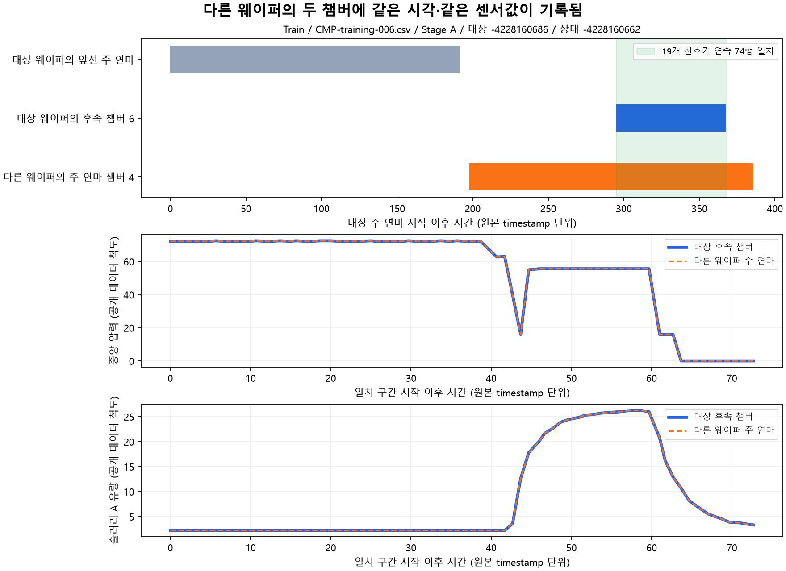

# Train 챔버 신호 출처 점검

**후속 챔버와 다른 웨이퍼의 주 연마 챔버에 동일 시각·동일 센서 신호가 반복 기록되는 현상을 확인했다.**
강한 일치는 1,495개 구간, 후속 챔버를 가진 738개 wafer-stage에서 발견됐다.
이 일치는 모두 상대 웨이퍼의 주 연마가 더 늦게 시작해 대상 후속 공정과 시간상 겹치는 경우였다.
이번 기준에서 같은 Stage의 **이전** 웨이퍼 주 연마와 지연 복사로 일치한 강한 구간은 0개다.
따라서 논문 3의 이전 웨이퍼 복사라는 설명을 우리 Train에서 그대로 확인했다고 결론 내리지 않는다.

## 확인 범위와 결과

- Train 원본 185개 파일, 672,744행, wafer-stage 1,981개를 모두 조사했다. 학습 시 제외했던 4개 표본도 이번 신호 조사에는 포함했다.
- 제거율 파일, 공식 Validation/Test 입력·정답을 읽지 않았다. 모델 재학습과 성능 비교는 수행하지 않았다.
- 동일 키·동일 센서의 중복 1,819행을 한 번만 셌다. 같은 키인데 센서값이 다른 401개 timestamp 키의 802개 고유 행은 평균하지 않고 검사에서 제외했다. 그 경계에서 연속 구간을 끊었다. 기존 학습 데이터는 수정하지 않았다.
- 정리 후 후속 챔버 308,889행 중 117,141행(37.92%)이 강한 일치 구간에 속한다. 분모는 검사 가능한 후속 챔버 행이다.
- wafer-stage 기준 738/1,981개(37.25%)에서 관찰했다. 나머지가 독립 신호라는 뜻은 아니다. Train에 대응하는 웨이퍼가 없거나, 구간이 짧거나, 신호 변화가 부족하면 이 기준으로 확인하지 못한다.

| Stage / route | 검사 후속 챔버 행 | 강한 일치에 포함된 행 | 해당 비율 |
|---|---:|---:|---:|
| A / 123 | 47,362 | 5,715 | 12.07% |
| A / 456 | 126,264 | 54,202 | 42.93% |
| B / 456 | 135,263 | 57,224 | 42.31% |

같은 Stage의 더 늦게 시작한 상대와 일치한 대상은 690개, 다른 Stage의 상대와 일치한 대상은 49개다. 한 대상이 두 범주에 포함돼 합계는 738개다.
하나의 행이 여러 후보 구간에 속할 수 있어, 행 비율은 구간 길이 합계가 아닌 중복 제거한 행 집합으로 계산했다.

## 판정 기준과 검증

19개 센서가 **모두 정확히 같은 값**이며 timestamp 이동량이 일정하고, 양쪽에서 10행 이상 연속인 구간을 찾았다.
관측 간격 60 초과와 충돌 timestamp에서는 구간을 끊었다. 원본 timestamp 단위이며 실제 초 단위라고 보장하지 않는다.
사용량을 제외한 센서 두 개 이상에서 각각 서로 다른 값 세 개 이상이 나타나야 강한 일치로 분류했다.
일정한 설정값이나 사용량 증가만 같아서는 강한 근거가 되지 않는다. 기준은 제거율을 보지 않고 고정한 검사 규칙이며 논문 저자의 판정식이나 통계적 유의성 기준은 아니다.

해시는 후보 검색에만 썼고 3,040,639개 후보 행 쌍에서 19개 값을 직접 대조했다.
10행 이상인 2,781개 구간 모두를 탐지용 행 쌍 테이블 없이 원래 신호 배열의 구간으로 다시 확인했다.
이 중 강한 기준을 충족한 1,495개는 모두 시간 이동량 0이었다.
같은 시각의 반복 기록은 확실하지만, 어떤 물리 센서의 값을 어느 웨이퍼에 귀속해야 하는지 또는 소프트웨어가 어떤 방향으로 복사했는지는 이 검사만으로 알 수 없다.



위 그림은 길이가 보통인 같은 Stage 사례를 규칙으로 골랐다. 원본 파일을 다시 읽어 74행·19개 신호와 timestamp의 완전 일치를 확인했다.
그림의 두 신호 곡선은 값이 같아 겹친다. 자세한 선정 규칙과 원본 파일은 [illustration.json](illustration.json)에 있다.

## 기존 검증 분할에 미치는 의미

강한 일치 1,495개 구간 모두 같은 원본 파일을 공유하며 기존 wafer/file 연결 그룹도 같다.
따라서 **그룹을 온전히 분리하는 기존 바깥 검증에서는 이번에 발견한 Train 내부 일치 쌍이 양쪽 그룹으로 갈라지지 않는다.**
wafer만 나누는 내부 CV나 공식 Train/Validation/Test 사이의 기록 중복은 이번 조사로 확인하지 않았다.
이 결과를 전체 파이프라인에 누수가 없다는 증명으로 해석하지 않는다. [그룹 확인](group_checks.json).

## 오차 감소 실험에 대한 판단

이 결과는 후속 챔버 통계가 현재 웨이퍼 자체의 연마만 표현하지 않을 수 있다는 근거다.
공유 장비 센서가 여러 웨이퍼 행에 기록됐을 가능성도 있어, 원인과 기록 구조를 구분해야 한다.
다른 웨이퍼의 동시 공정 상태가 예측에 유용할 수도 있으므로 해당 입력을 무조건 삭제하면 성능이 좋아진다고 말할 수 없다.

다음 제한된 비교는 **기존 P2 전체 특징 vs secondary 특징 제외**가 적절하다.
같은 표본·분할·이력 정책·모델 설정·특징 선택/가중치 계산 절차를 유지하고, 입력 변경에 따른 재학습 효과를 비교한다.
동시 공정 문맥으로 따로 표현하는 후보는 그 다음에 추가한다. 이전 웨이퍼로 재배정하는 후보는 이번 근거로 정당화되지 않는다.
선택은 Train 내부에서 하고, 바깥 그룹·시간순 결과와 기존 공식 참고 평가를 구분한다. 현재까지 오차가 줄었다는 신규 결과는 없다.

## 재현과 산출물

```powershell
python -m cmp_ml.chamber_audit --run-dir runs/my_chamber_audit
python tools/report_chamber_audit.py --run-dir runs/my_chamber_audit
python -m pytest tests/test_chamber_audit.py -q
```

기존 캐시를 재사용하지 않고 원시 Train 공정 파일을 읽으며, 185개 파일의 해시를 기존 실험 출처와 확인한다.
이미 존재하는 run 폴더는 덮어쓰지 않는다. 데이터 원본은 저장소에 포함하지 않는다.

- [고정 검사 기준·입력 해시](protocol.json), [요약](summary.json), [직접 값 재검증](verification.json)
- [전체 연속 일치 구간](blocks.csv.gz), [개별 챔버 구간](segments.csv.gz), [wafer-stage별 집계](samples.csv)
- [조건별 행 집계](condition_summary.csv), [동일 timestamp 충돌 키](conflicting_keys.csv), [긴 사례 목록](examples.csv)
- [분석 소스 스냅샷](audit_source.py), [그림·보고서 소스 스냅샷](report_source.py), [파일 무결성 목록](artifact_manifest.json)
- [이 검사를 시작한 논문 검토](../../docs/paper-guided-next-experiments.md)

검사 결과는 기록 일치에 대한 기술적 분석이며 물리적 인과관계, 라벨 오류, 모델 정확도 개선의 증명이 아니다.
