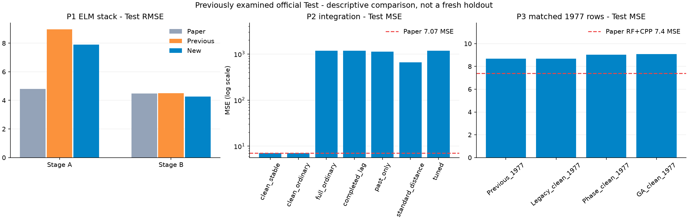

# 세 논문 누락 절차 구현·실행 결과 v3

85개 후보의 RF 선택, P2 회귀·이력·설정 민감도, P3 실제 GA 탐색을 구현하고 학습·평가했습니다. **원문에 없는 설정은 가정을 명시한 부분 재현**입니다. 성능 개선을 보장하는 작업이 아니며 기존 API/Unity 모델은 유지합니다.

핵심 결과: P1 ELM Test RMSE는 Stage A **8.9624 → 7.8971**, B **4.5035 → 4.2687**로 낮아졌습니다. P2는 추가 OLS 절단을 제거해도 통합 Test MSE **7.0743**로 사실상 동일합니다. P3는 같은 1,977행에서 GA+CPP MSE가 **8.6851 → 9.0837**로 악화됐습니다. 네 극단값을 포함한 1,981행 후보들은 크게 악화됐으며, 튜닝이나 GA를 추가했다고 자동으로 개선되는 것은 아니었습니다.



## 논문 1: 85개 후보에서 선택하는 과정

76개 시간 통계 + 9개 주파수 통계를 구성했습니다. 기존 Appendix35 값은 원시 로그에서 다시 추출한 값과 일치했습니다. 두 FFT 관례, 특징 수 5/20/35/50/65/85, 세 기본 학습기, 두 Stage, 20회 반복으로 **1,440회 기본 모델 학습**을 수행했습니다. RF 중요도 순위는 Train에서만 80회 계산했습니다. 공통 특징 수/FFT는 세 모델의 20회 평균 Validation MSE로 선택했습니다.

- Stage A: `rows_dc`, **20개** 선택. seed 0의 학습 상위35와 Appendix35의 교집합은 11/35개.
- Stage B: `time_ac`, **35개** 선택. seed 0의 학습 상위35와 Appendix35의 교집합은 16/35개.

최종 스태킹의 다섯 내부 fold에서도 특징 선택을 새로 수행했습니다. CART/ELM 설정은 이전 v2의 설정을 고정했습니다. 아래 신규·기존 Test 수치는 **저장 모델 seed 20260917의 단일 실행**이며 논문의 반복 평균과 동일한 통계량이라고 주장하지 않습니다. 20회 반복 분포는 [Validation 반복 결과](p1_repeat_summary.csv)에 있습니다. Test에서 20회 재선택하지 않았습니다.

| Stage | Model | Paper_RMSE | Previous_RMSE | New_RMSE |
| --- | --- | --- | --- | --- |
| A | GBT | 6.5520 | 7.5143 | 7.5481 |
| A | RF | 5.3950 | 7.8929 | 7.7881 |
| A | ERT | 7.0480 | 9.2345 | 8.2023 |
| A | CART_Stack | 5.0650 | 9.1721 | 7.5422 |
| A | ELM_Stack | 4.7950 | 8.9624 | 7.8971 |
| B | GBT | 4.7810 | 4.8653 | 4.2400 |
| B | RF | 4.5980 | 4.6548 | 4.3383 |
| B | ERT | 4.7920 | 4.6664 | 4.5505 |
| B | CART_Stack | 4.5000 | 5.0127 | 4.5792 |
| B | ELM_Stack | 4.4850 | 4.5035 | 4.2687 |

[전체 특징 순위](p1_rankings.csv), [특징 개수별 원시 평가](p1_validation_grid.csv), [선택값](selection.json).

## 논문 2: 일반 LR, 이력, 하이퍼파라미터

표의 단위는 **MSE**입니다. 원문 Table 5의 통합 모델 MSE는 **7.07**, 이전 구현은 **7.0743**였습니다. 일반 LR은 추가 rcond=1e-6 절단을 제거하되 sklearn 수치해법의 기본 rank 처리는 남습니다.

| Arm | Validation_MSE | Test_MSE | LR_Test_MSE |
| --- | --- | --- | --- |
| clean_stable | 6.8277 | 7.0743 | 351.1079 |
| clean_ordinary | 6.8277 | 7.0743 | 351.1079 |
| full_ordinary | 3364.3712 | 1174.4620 | 32656.1719 |
| completed_lag | 2885.5399 | 1174.8941 | 13216.6274 |
| past_only | 1885.3995 | 1121.6353 | 10739.0329 |
| standard_distance | 1713.9805 | 664.0751 | 48277.5682 |
| tuned | 3376.1374 | 1178.9635 | 32656.1719 |

`clean_stable`은 1,977행·기존 안정화 대조군, `clean_ordinary`는 같은 데이터의 일반 LR, `full_ordinary`는 1,981행 일반 LR입니다. `completed_lag`는 종료된 lag만, `past_only`는 이웃도 종료된 과거만 참조합니다. `standard_distance`는 사용량 거리의 표준화를 적용합니다. `tuned`는 full_ordinary의 fold별 특징을 공유하고 SVR 6종/Bagging 4종에서 Train-CV mean+3SD MSE로 선택했습니다.

- Cond1: {'P2_SVR': 'svr_C10_g0.01', 'P2_Bagging': 'bag_T300_L1'}
- Cond2: {'P2_SVR': 'svr_C10_g0.01', 'P2_Bagging': 'bag_T300_L1'}
- Cond3: {'P2_SVR': 'svr_C100_gscale', 'P2_Bagging': 'bag_T100_L5'}

총 **360개 내부 분할**의 이력·특징 선택·기본 모델을 학습했습니다. 튜닝 CV는 탐색과 가중치 산정에 재사용되어 낙관적일 수 있습니다. 분할 비율, t 계산의 rank 처리, OOB 숲 크기, 투표 기준 등 미기재 조건은 여전히 가정입니다. 여러 이력 정책은 이용 가능한 정보 자체가 다르므로 점수만으로 우열을 단정하지 않습니다. Test로 최종 arm을 선정하지 않았습니다.

## 논문 3: 구간 판정과 GA

원문에 명시된 종류로 **rough 45개 / fine 12개 후보**를 구성했습니다. 논문의 rough 47개 전체 목록은 없어 두 항목을 임의로 채우지 않았습니다. Rough는 세 가지 pressure/slurry 문턱값을 비교하고 긴 시간 공백을 제외했습니다. Fine은 논문 설명처럼 첫 챔버의 세부 단계를 합칩니다. CPP는 기존의 라벨 없는 machine/route·500 간격 정의를 유지하며, 잔차 보정에는 Train 정답만 씁니다. 원문은 전체 2,929회/1,267 CPP를 서술하지만 제공된 공식 세 분할의 합계는 2,829개 wafer-stage이며, 현재 규칙은 1014 CPP를 구성합니다. 이 차이도 원문만으로 해소하지 못했습니다.

실제 GA는 특징 mask와 모델 종류를 함께 탐색합니다. population 12, 8 generations, 엘리트·교차·돌연변이·캐시를 사용했습니다. 모델 후보는 결정트리, KNN, SVR, 5개 신경망 앙상블, RF입니다. 초기 후보에 모든 모델 종류와 발표 최종 특징의 RF를 포함했습니다. GA 선택용 Train-CV 점수는 독립 검증 점수가 아닙니다.

- route 456: `strict` / `rf` / 10개 특징 / 선택용 Train-CV MSE 9.9260.
- route 123: `nominal` / `knn` / 9개 특징 / 선택용 Train-CV MSE 64633.6834.

추가 대조군: Train 진단에서 fine의 네 극단값 4,129~4,326(전체 fine 중앙값 약151)이 발견돼, **Test 평가 전에** [동일 1,977행 조건](p3_clean_sensitivity_protocol.json)을 추가로 고정했습니다. 기존과 같은 네 표본만 제외하고 fine GA를 같은 설정으로 다시 실행했으며 rough 모델은 그대로 공유합니다. P3 원저자가 이 네 표본을 제외했다고 단정하지 않습니다. 이 대조군의 fine 선택은 `rf`, 6개 특징, 선택용 CV MSE 6.1985입니다.

| Search | Unique_candidates | Failures | Warning_count | Best_CV_MSE |
| --- | --- | --- | --- | --- |
| p3_123_nominal | 58 | 0 | 0 | 64633.6834 |
| p3_456_loose | 65 | 0 | 20 | 10.0245 |
| p3_456_nominal | 65 | 0 | 19 | 10.0496 |
| p3_456_strict | 65 | 0 | 18 | 9.9260 |
| p3clean_123_nominal | 61 | 0 | 0 | 6.1985 |

경고 수와 메시지는 후보 로그에 보존했습니다. 실패한 후보를 조용히 제외하거나 수렴 경고를 숨기지 않습니다. [각 후보·실패·경고·선택 mask](p3_456_nominal_evaluations.json), [세대별 기록](p3_456_nominal_generations.json), [구간 fallback 요약](phase_qc_summary.csv).

원문 Table II의 실제 Test **MSE**는 RF **7.6**, 신경망 앙상블 **8.2**, RF+CPP **7.4**입니다. 아래 GA 모델은 선택된 종류가 RF가 아닐 수도 있으므로 원문 RF와 같은 모델의 직접 재현으로 해석하지 않습니다.

| Arm | RF_or_GA_MSE | Corrected_MSE |
| --- | --- | --- |
| Previous_1977 | 9.4774 | 8.6851 |
| Legacy_1981 | 8001.8588 | 7995.4650 |
| Phase_1981 | 8002.1661 | 7995.9141 |
| GA_selected_1981 | 2513.9032 | 2513.4365 |
| Legacy_clean_1977 | 9.4774 | 8.6851 |
| Phase_clean_1977 | 9.6665 | 9.0255 |
| GA_clean_1977 | 9.5047 | 9.0837 |

`Legacy_1981`과 `Phase_1981`은 같은 1,981행에서 발표된 최종 특징에 대응하는 RF입니다. 새 phase 경로는 center pressure 적분(기존 chamber pressure), 첫 시각 사용량 평균, 공백 제외 및 공통 전처리를 함께 적용하므로 **문턱값 하나만 바꾼 단일 요인 실험은 아닙니다**. GA와 phase 고정 특징 결과를 따로 보고합니다. 전체 모델·조건·Stage 지표는 [metrics.csv](metrics.csv)에 있습니다.

## 재현 범위와 검증

- Test/Validation은 과거 실험에서도 확인한 공식 데이터입니다. 새 독립 검증이나 공정 일반화 입증이 아닙니다.
- P1 주파수·중요도 정의, P2 완전한 이력·설정, P3 47개 목록·GA 설정·정확한 phase 문턱값은 원문만으로 확정할 수 없습니다. [사전 고정 프로토콜](PROTOCOL.md)이 명시 조건과 가정을 구분합니다.
- 32개 모델을 실제 재로딩하고, 정답을 오염시키고 행 순서를 바꾼 입력에서도 예측이 동일함을 확인했습니다. 최대 재생 차이 2e-12.
- 944개 지표, P1 선택, P2 fold/투표/가중식, GA 로그·선택을 재계산했습니다. 이전 산출물 1171개 해시를 보존했습니다. [검증 기록](independent_verification.json).
- 코드 전체 테스트 **148개 통과**, 기존 경고 4개. FFT·공백·특징 일치·이력 제한·GA 분할·튜닝 결합 오류의 회귀 테스트를 포함합니다. [테스트 기록](test_results.json).
- 학습 중 pandas 3의 읽기 전용 배열 때문에 튜닝 오차를 합치는 단계가 실패했습니다. 쓰기 가능한 복사본을 만들도록 수정하고 실패한 세 작업을 다시 실행했습니다. 모델·후보·선택 규칙·seed는 바꾸지 않았고 Test 평가 전 수정입니다. [원본 코드·프로토콜과 수정 기록](amendments/01_pandas_writable_array/amendment.json), 기존 95개 학습 체크포인트의 동일성도 확인했습니다.

## 원문

1. Li, Wu, Yu (2019), [Prediction of Material Removal Rate ... Using Decision Tree-Based Ensemble Learning](https://mae.ucf.edu/dazhongwu/wp-content/uploads/2019/06/Prediction-of-Material-Removal-Rate-for-Chemical-Mechanical-Planarization-Using-Decision-Tree-Based-Ensemble-Learning.pdf), §4.2, Fig.4-6, Tables5/7/8, Appendix.
2. Di, Jia, Lee (2017), [PHM Society manuscript 2641](https://papers.phmsociety.org/index.php/ijphm/article/view/2641), §2.3-2.4, §3.2, Tables3-5. 보관된 파일명 2020은 논문의 발표 연도가 아닙니다.
3. Li et al. (2018), [Atlantis Press 25894228](https://www.atlantis-press.com/proceedings/iceea-18/25894228), Fig.III, §IV-V, TableII.

## 실행

저장된 결과를 덮어쓰지 않도록 완료 실험의 재학습/재평가를 차단합니다. 새 실험은 run/cache 이름을 변경하고 새 프로토콜을 고정해야 합니다. 원본 데이터는 저장소에 포함되지 않습니다.

```powershell
python -m cmp_ml.completion prepare
python -m cmp_ml.completion train --workers 4
python tools/complete_p3_clean_sensitivity.py prepare
python tools/complete_p3_clean_sensitivity.py train
python -m cmp_ml.completion evaluate
python tools/verify_completion.py
python tools/report_completion.py
```
