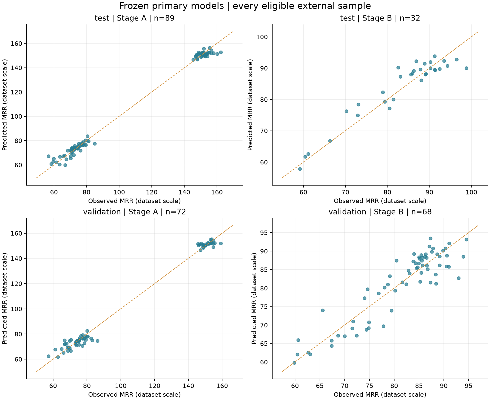
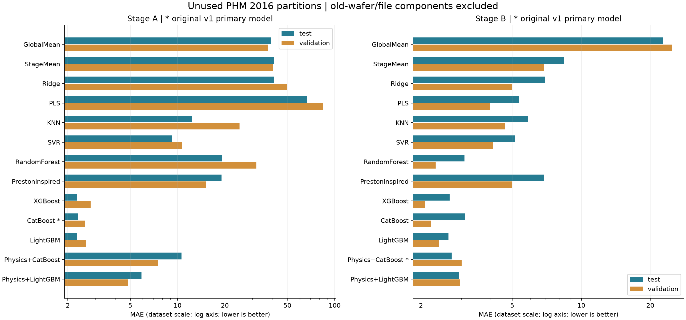

# 이전에 사용하지 않은 PHM 2016 데이터 평가

**평가 완료:** 공식 test·validation 분할의 공개 보관본에서 원본 시계열 370개와 정답 848개를 확보했습니다. 기존 데이터와 웨이퍼 또는 파일 연결 그룹이 겹치는 표본을 제외한 **test 121개·validation 140개**를 채점했습니다. 이 점수는 중복을 제외한 부분집합의 결과이며, 공식 전체 분할 점수나 대회 순위가 아닙니다.

## 기존 선정 모델의 결과

| 구분 | Stage | 고정 선정 모델 | 표본 | 그룹 | MAE | RMSE | R² | 90% 구간 coverage (%) |
| --- | --- | --- | --- | --- | --- | --- | --- | --- |
| test | A | CatBoost | 89 | 56 | 2.3131 | 3.0954 | 0.9940 | 96.6292 |
| test | B | Physics+CatBoost | 32 | 20 | 2.7250 | 3.3803 | 0.8955 | 100.0000 |
| validation | A | CatBoost | 72 | 47 | 2.5815 | 3.5518 | 0.9914 | 97.2222 |
| validation | B | Physics+CatBoost | 68 | 38 | 3.0103 | 3.7650 | 0.8168 | 98.5294 |

Stage A는 기존 CatBoost, Stage B는 기존 Physics+CatBoost를 주 평가 모델로 유지했습니다. 26개 기존 모델의 해시와 주 평가 모델을 새 데이터 정답 조회 전에 고정했고, 재학습·재보정·설정 변경을 하지 않았습니다. 따라서 이전 v1 Test보다 숫자가 좋아진 것은 학습으로 성능을 개선했다는 증거가 아니라 평가 데이터 구성이 달라진 결과입니다.

Stage B는 test 32개·validation 68개로 작습니다. test에서 Physics+CatBoost는 CatBoost·RandomForest보다 MAE가 작았지만, validation에서는 XGBoost·CatBoost 등의 단독 ML보다 컸습니다. 이전 내부 교차검증과 함께 보면 모델 순위는 평가 집단에 따라 바뀝니다. 새 외부 점수를 보고 주 모델을 교체하거나 재튜닝하지 않았습니다.

## 중복 제외와 데이터 검사

| 구분 | 원본 표본 | 기존 웨이퍼 직접 중복 | 그룹 단위 제외 | 새 Chamber 제외 | 평가 표본 | Stage A | Stage B |
| --- | --- | --- | --- | --- | --- | --- | --- |
| test | 424 | 113 | 303 | 0 | 121 | 89 | 32 |
| validation | 424 | 115 | 284 | 0 | 140 | 72 | 68 |

기존 웨이퍼 직접 중복 수는 해당 WAFER_ID가 이전 1,981개 표본 중 어디든 존재하는 경우입니다. 그룹 단위 제외 수는 그 웨이퍼와 같은 파일을 공유하는 다른 웨이퍼까지 전이적으로 포함합니다. 따라서 직접 중복 수와 그룹 단위 제외 수를 더하면 안 됩니다. 두 Stage와 이전 Train·Validation·Calibration·Test 전체를 비교 대상으로 사용했습니다.

- test 시계열 156,262행, validation 144,148행입니다.
- 빈 파일 57개를 기록했습니다. 파생 데이터에서 동일 측정 행 532개를 제거했으며 원본은 유지했습니다.
- 13개 표본이 파일을 걸쳤고, 장비와 시간 범위를 검사했습니다. 0개 긴 공백은 기존 v1과 같은 AUC 규칙으로 처리했습니다.
- 기존에 없던 Chamber는 0건입니다. 기존 전처리·특징 계산·모델을 그대로 사용했습니다.
- 정답은 cohort/WAFER_ID/STAGE 기준으로 원본 표본 전체와 정확히 일대일 연결되는지 검사했습니다. 정답값을 기준으로 표본을 제외하지 않았습니다.

## 해석 범위와 남은 조건

이전 데이터의 TIMESTAMP 범위는 [481634409.667, 487268210.333], 새 평가 파일의 범위는 [481638013.333, 487268403.333]로 겹칩니다. 이번 실험은 모델이 쓰지 않았던 동일 PHM 2016 분할에 대한 평가이며, 새 공장·새 장비·미래 생산 시점 검증은 아닙니다. 파일 그룹은 제공된 파일과 웨이퍼 ID로 정의했으며 실제 생산 lot의 완전한 독립성을 보장하지 않습니다.

90% 예측구간은 기존 v1 Calibration으로 만든 반경을 그대로 썼습니다. 주 모델의 실측 coverage는 96.63–100%로 명세의 85–95% QA 범위를 벗어나며 구간 폭·보정 점검이 남아 있습니다. 작은 표본과 그룹 상관을 고려해야 하므로 90% coverage의 통계적 보장이나 서비스 배포 승인으로 해석하지 않습니다. R²도 분류 정확도 백분율이 아닙니다.

## 전체 고정 모델 비교

| cohort | stage | model | n | mae | rmse | r2 | negative_predictions |
| --- | --- | --- | --- | --- | --- | --- | --- |
| test | A | CatBoost | 89 | 2.3131 | 3.0954 | 0.9940 | 0 |
| test | A | GlobalMean | 89 | 39.3807 | 40.1702 | -0.0023 | 0 |
| test | A | KNN | 89 | 12.3691 | 51.4454 | -0.6440 | 0 |
| test | A | LightGBM | 89 | 2.2901 | 3.1646 | 0.9938 | 0 |
| test | A | PLS | 89 | 66.3465 | 101.6817 | -5.4223 | 7 |
| test | A | Physics+CatBoost | 89 | 10.6129 | 44.3808 | -0.2235 | 0 |
| test | A | Physics+LightGBM | 89 | 5.8972 | 14.7790 | 0.8643 | 0 |
| test | A | PrestonInspired | 89 | 19.0738 | 32.4442 | 0.3461 | 0 |
| test | A | RandomForest | 89 | 19.2243 | 69.2654 | -1.9802 | 0 |
| test | A | Ridge | 89 | 41.1028 | 75.3473 | -2.5265 | 1 |
| test | A | SVR | 89 | 9.2278 | 13.0144 | 0.8948 | 0 |
| test | A | StageMean | 89 | 41.0215 | 42.5907 | -0.1268 | 0 |
| test | A | XGBoost | 89 | 2.2889 | 3.1389 | 0.9939 | 0 |
| test | B | CatBoost | 32 | 3.1239 | 3.8433 | 0.8649 | 0 |
| test | B | GlobalMean | 32 | 22.6956 | 24.9882 | -4.7118 | 0 |
| test | B | KNN | 32 | 5.8781 | 7.2899 | 0.5139 | 0 |
| test | B | LightGBM | 32 | 2.6334 | 3.4176 | 0.8932 | 0 |
| test | B | PLS | 32 | 5.3693 | 6.3761 | 0.6281 | 0 |
| test | B | Physics+CatBoost | 32 | 2.7250 | 3.3803 | 0.8955 | 0 |
| test | B | Physics+LightGBM | 32 | 2.9442 | 3.7322 | 0.8726 | 0 |
| test | B | PrestonInspired | 32 | 6.8586 | 8.0193 | 0.4117 | 0 |
| test | B | RandomForest | 32 | 3.0957 | 3.9819 | 0.8550 | 0 |
| test | B | Ridge | 32 | 6.9539 | 8.1970 | 0.3854 | 0 |
| test | B | SVR | 32 | 5.1525 | 6.3460 | 0.6316 | 0 |
| test | B | StageMean | 32 | 8.4371 | 10.4589 | -0.0006 | 0 |
| test | B | XGBoost | 32 | 2.6708 | 3.5070 | 0.8875 | 0 |
| validation | A | CatBoost | 72 | 2.5815 | 3.5518 | 0.9914 | 0 |
| validation | A | GlobalMean | 72 | 37.5768 | 38.4075 | -0.0013 | 0 |
| validation | A | KNN | 72 | 24.8147 | 107.1657 | -6.7954 | 0 |
| validation | A | LightGBM | 72 | 2.6153 | 3.6775 | 0.9908 | 0 |
| validation | A | PLS | 72 | 84.7109 | 140.7394 | -12.4449 | 7 |
| validation | A | Physics+CatBoost | 72 | 7.4821 | 24.7659 | 0.5837 | 0 |
| validation | A | Physics+LightGBM | 72 | 4.8321 | 6.8268 | 0.9684 | 0 |
| validation | A | PrestonInspired | 72 | 15.1090 | 24.4088 | 0.5956 | 0 |
| validation | A | RandomForest | 72 | 31.7180 | 218.7480 | -31.4800 | 0 |
| validation | A | Ridge | 72 | 49.8701 | 96.7027 | -5.3475 | 1 |
| validation | A | SVR | 72 | 10.6443 | 13.6852 | 0.8729 | 0 |
| validation | A | StageMean | 72 | 40.7317 | 42.2270 | -0.2103 | 0 |
| validation | A | XGBoost | 72 | 2.7934 | 3.9946 | 0.9892 | 0 |
| validation | B | CatBoost | 68 | 2.2065 | 2.8215 | 0.8971 | 0 |
| validation | B | GlobalMean | 68 | 24.8119 | 26.3254 | -7.9543 | 0 |
| validation | B | KNN | 68 | 4.6550 | 6.6878 | 0.4221 | 0 |
| validation | B | LightGBM | 68 | 2.3932 | 3.0863 | 0.8769 | 0 |
| validation | B | PLS | 68 | 3.9956 | 5.1882 | 0.6522 | 0 |
| validation | B | Physics+CatBoost | 68 | 3.0103 | 3.7650 | 0.8168 | 0 |
| validation | B | Physics+LightGBM | 68 | 2.9704 | 3.7846 | 0.8149 | 0 |
| validation | B | PrestonInspired | 68 | 4.9877 | 6.1496 | 0.5114 | 0 |
| validation | B | RandomForest | 68 | 2.3156 | 3.0089 | 0.8830 | 0 |
| validation | B | Ridge | 68 | 5.0014 | 6.5093 | 0.4525 | 0 |
| validation | B | SVR | 68 | 4.1433 | 5.6288 | 0.5906 | 0 |
| validation | B | StageMean | 68 | 6.8897 | 8.9901 | -0.0443 | 0 |
| validation | B | XGBoost | 68 | 2.0927 | 2.8797 | 0.8929 | 0 |

평균 기준선은 이전 Train의 평균입니다. Stage A 학습의 알려진 극단값과 서로 다른 Chamber 경로의 영향을 받으므로 그 기준선 대비 개선만으로 모델 우월성을 과장하지 않습니다. 음수·매우 큰 예측도 주 점수에서 숨기거나 잘라내지 않았습니다.

## 출처와 재현 검증

- [PHM Society 공식 배포 안내](https://phmsociety.org/conference/annual-conference-of-the-phm-society/annual-conference-of-the-prognostics-and-health-management-society-2016/phm-data-challenge-4/)에 별도 test·validation 분할 및 정답 배포가 안내돼 있습니다.
- 사용한 파일은 [공개 보관본의 고정 커밋](https://github.com/akangel0307/PHM-Data-Challenge/tree/00d443e3f57379e3ad3d12c15a0738282b8210e5) `00d443e3f57379e3ad3d12c15a0738282b8210e5`에서 받았습니다.
- 공식 ZIP 연결은 이번 환경에서 정상 다운로드로 이어지지 않았습니다. 보관본의 학습 시계열 185개와 학습 정답 1개는 기존 데이터와 바이트 단위로 모두 일치합니다. 정답은 보관본의 PHM16TestValidationAnswers 아래 orig_ 파일을 사용했고, 보관본의 작업용 정답 파일과 Git blob 해시가 같은지 검사했습니다.
- 다운로드한 372개 CSV의 고정 버전·크기·Git blob SHA-1·SHA-256을 기록했습니다. 공식 배포자의 별도 정답 체크섬은 확보하지 못했으므로 정답의 출처는 해당 공개 보관본까지 검증한 것입니다. 저장소의 코드 라이선스를 원본 데이터의 재배포 허가로 해석하지 않습니다.
- 원본 CSV와 전체 특징표는 Git에 포함하지 않습니다. 모델 예측·점수·분할/제외 목록·해시·코드는 결과 증거로 남겼습니다.
- 예측·제외 목록을 고정한 뒤 정답을 다운로드했고, 채점 시작 전에 봉인 파일을 썼습니다. 같은 결과 폴더의 재예측·재채점은 차단합니다.
- 모델 26개 모두 저장된 특징표로 예측·구간을 재현했습니다. 최대 점 예측 차이는 1.14e-13입니다.
- 기존 v1 파일 전체와 모델 26개의 해시가 유지됐고, 이전 Stage B 교차검증 결과도 보존했습니다.

실행 명령은 저장소 README를 참고하세요. 폴더를 새로 만들어 같은 정답으로 재튜닝해도 새 독립 평가가 되지 않습니다.
