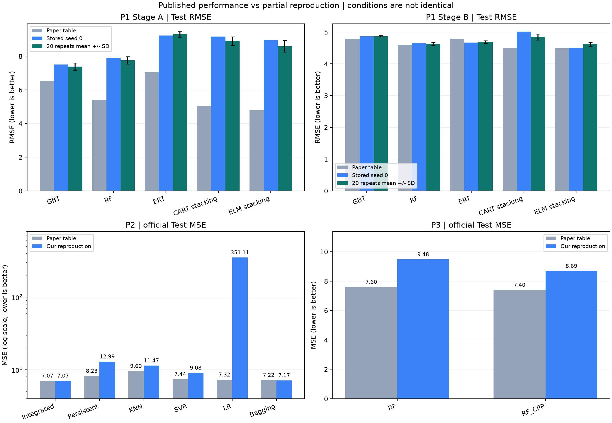

# 세 CMP 논문의 발표 성능과 구현 성능 — 최종 비교

요청한 후속 시간순 선택 실험까지 완료하고 **원문 표 ↔ 저장된 재현 모델 ↔ 20회 반복 결과**를 대조했다.
**세 논문 모두 원문과 완전히 동일한 성능으로 재현된 것은 아니다.** P2 통합 모델은 원문 7.07에 가까운
MSE **7.0743**을 얻었지만, P2 LR과 P1 Stage A 등은 큰 격차가 남아 있다.
가정·미구현 항목이 있는 부분 재현이며, 반올림한 점수의 일치가 알고리즘 전체의 일치를 증명하지 않는다.

## 기준과 출처

| 구분 | 논문 | 이번 비교 위치·지표 |
|---|---|---|
| P1 | [Prediction of Material Removal Rate for Chemical Mechanical Planarization Using Decision Tree-Based Ensemble Learning](https://doi.org/10.1115/1.4042051) (2019) | PDF 11쪽 Table 7/8, Stage A/B의 Test RMSE·R²·RE·S-score |
| P2 | [Enhanced Virtual Metrology on Chemical Mechanical Planarization Process using an Integrated Model and Data-Driven Approach](https://papers.phmsociety.org/index.php/ijphm/article/view/2641) (2017) | PDF 7쪽 Table 5, 공식 Test MSE |
| P3 | [Assessment of Physics-Based and Data-Driven Models for Material Removal Rate Prediction in Chemical Mechanical Polishing](https://www.atlantis-press.com/proceedings/iceea-18/25894228) (2018) | PDF 5쪽 Table II의 Real test MSE |

사용자가 제공한 PDF의 해당 표를 시각적으로 확인했다. [파일 이름·SHA256·원문 값](paper_sources.json).
P2 파일명의 2020은 논문 연도가 아니다. 아래 우리 수치는 보존된
[원문 조건 재구성 v2](../phm_cmp_reconstruction_v2/REPORT.md)의 저장 예측에서 다시 계산했다.
첫 구현 v1과 후속 제안 모델을 이 표의 우리 값으로 바꿔 넣지 않았다.

**MSE·RMSE·RE는 낮을수록, R²는 높을수록 좋다.** RMSE는 MSE의 제곱근이며 같은 수치 단위가 아니다.
증감률은 `(우리 지표 / 논문 지표 - 1) × 100`으로, 양수면 오차 증가다. 정확도의 증감률이 아니다.
MSE에 %를 붙여 '오차율 7.07%'로 표현하지 않는다. 원문은 반올림값이므로 격차도 그 값 기준이다.

## P1: Stage별 모델, Test RMSE

| Stage | 모델 | 논문_RMSE | 우리_저장모델_RMSE | 저장모델_증감_pct | 우리_20회_평균_SD | 20회평균_증감_pct |
|---|---|---|---|---|---|---|
| A | P1_GBT | 6.5520 | 7.5143 | 14.6876 | 7.3867 ± 0.2152 | 12.7398 |
| A | P1_RF | 5.3950 | 7.8929 | 46.3010 | 7.7602 ± 0.2114 | 43.8414 |
| A | P1_ERT | 7.0480 | 9.2345 | 31.0236 | 9.3036 ± 0.1589 | 32.0033 |
| A | P1_CART_Stack | 5.0650 | 9.1721 | 81.0871 | 8.9008 ± 0.2518 | 75.7318 |
| A | P1_ELM_Stack | 4.7950 | 8.9624 | 86.9107 | 8.6022 ± 0.3417 | 79.3997 |
| B | P1_GBT | 4.7810 | 4.8653 | 1.7634 | 4.8682 ± 0.0188 | 1.8239 |
| B | P1_RF | 4.5980 | 4.6548 | 1.2359 | 4.6294 ± 0.0476 | 0.6838 |
| B | P1_ERT | 4.7920 | 4.6664 | -2.6215 | 4.6844 ± 0.0434 | -2.2463 |
| B | P1_CART_Stack | 4.5000 | 5.0127 | 11.3926 | 4.8467 ± 0.0964 | 7.7045 |
| B | P1_ELM_Stack | 4.4850 | 4.5035 | 0.4126 | 4.6180 ± 0.0604 | 2.9660 |

우리 저장 모델은 seed 0 실행이다. 20회 열은 seed 0–19의 평균과 표본 표준편차이며 저장 모델의 점수와 다르다.
논문은 계산 실험을 20회 반복한다고 설명하지만 표의 집계·seed까지 같다고 확인할 수는 없다.
SD는 반복 간 변동이며 신뢰구간이 아니다.

- 논문 Stage A/B의 최저 RMSE는 모두 ELM stacking **4.795 / 4.485**다.
- 우리 Stage A의 최저 RMSE는 GBT(저장 **7.5143**, 반복 평균 **7.3867**)이고,
  Stage B는 ELM stacking(저장 **4.5035**, 반복 평균 **4.6180**)이다.
- Stage B ELM 저장 결과는 원문 대비 약 **0.41%** 높지만, Stage A ELM은 약 **86.91%** 높다.
  특정 Stage의 가까운 결과를 전체 논문의 재현 성공으로 확대하지 않는다.
- 원문 Table 6은 전체 공정용 모델이다. 우리 Stage별 모델을 합친 점수와 Table 6을 같은 실험으로 비교하지 않았다.
- R²·RE·Validation 결과도 [전체 지표 대조표](paper_metric_comparison.csv)에 포함했다.
  S-score는 원문 식의 exp 값이 1 이상인 반면 표에는 1 미만 값이 있어 정의에 모호성이 있다.
  식 그대로의 exp 평균과 exp−1 평균을 모두 보존하고, 원문 S-score와의 개선률·순위는 계산하지 않았다.

## P2: 공식 Test MSE

| 모델 | 논문_MSE | 우리_MSE | 증감_pct |
|---|---|---|---|
| P2_Integrated | 7.0700 | 7.0743 | +0.06% |
| P2_Persistent | 8.2300 | 12.9890 | +57.83% |
| P2_KNN | 9.6000 | 11.4710 | +19.49% |
| P2_SVR | 7.4400 | 9.0810 | +22.06% |
| P2_LR | 7.3200 | 351.1079 | +4696.56% |
| P2_Bagging | 7.2200 | 7.1702 | -0.69% |
| P2_DBN | 7.2900 | 미구현 | — |

**통합 모델 7.07 → 7.0743(+0.0610%)**은 두 자리까지 같고, Bagging은 7.22 → 7.1702다.
그러나 **LR 7.32 → 351.1079**는 큰 불일치다. 통합 결과만으로 개별 모델들이 원문대로 재현됐다고 판단할 수 없다.
DBN은 논문 비교표에 등장하지만 이번 baseline에는 구현하지 않았다.
Table 4의 내부 CV MSE와 Table 5의 Test MSE는 서로 다른 평가이므로 섞지 않았다.

## P3: 공식 Real test MSE

| 모델 | 논문_MSE | 우리_MSE | 증감_pct |
|---|---|---|---|
| P3_RF | 7.6000 | 9.4774 | +24.70% |
| P3_RF_CPP | 7.4000 | 8.6851 | +17.37% |
| P3_Ensemble_NN | 8.2000 | 미구현 | — |

RF의 CPP 보정으로 우리 MSE는 **9.4774 → 8.6851**로 낮아졌지만,
원문 보정 RF **7.4**보다 약 **17.37%** 높다. 원문의 Self test 7.2와 Real test 7.4는 구분했다.
Ensemble Neural Network와 전체 GA 특징 탐색은 구현하지 않았다.

## 우리 구현끼리 같은 Test에서 비교하면

13개 구현의 공식 Test ID 424개와 정답이 동일함을 확인했다. 이 저장 예측 범위에서는
가장 낮은 전체 MSE가 **P2_Integrated: 7.0743**, 가장 높은 값이 **P2_LR: 351.1079**다.
[전체 13개 순위·MSE·RMSE·R²](our_common_test_ranking.csv).
P1 다섯 모델 안에서는 전체 Test의 GBT MSE **42.0792**가 가장 낮다.

이는 현재 구현의 수치 비교다. P2는 다른 Train 표본의 계측 제거율 이력을 사용하고,
P3는 ID·CPP 특징을 사용하며 P1은 공정 통계 중심이어서 입력 정보가 동일하지 않다.
따라서 이 순위를 세 논문의 일반적인 알고리즘 우열이나 새로운 웨이퍼의 독립 예측 성능으로 해석하지 않는다.

## 추가 오차 감소 실험: 논문 재현과 별도

이 표는 **완료된 과거 공정의 Train 계측값만 참조**하는 정책으로 비교한 제안 모델 절차다.
논문 비교 P2의 7.0743은 이웃/이력 허용 조건이 달라 이 표에 합치지 않았다.
모든 행은 동일한 바깥 그룹 분할·시간순 표본·공식 Validation/Test를 사용한다.

| procedure | nested_oof | temporal | validation | test |
|---|---|---|---|---|
| Stable v1 | 22.4289 | 12.4201 | 8.9955 | 9.3458 |
| Robust v2 | 21.7694 | 11.7714 | 8.5402 | 8.9491 |
| Group selection v3 | 18.6431 | 14.3296 | 8.9916 | 11.3107 |
| Time selection v4 | 24.4634 | 14.6734 | 12.5853 | 13.8081 |

최신 v4는 그룹 내부 선택 대신 여러 시점의 시간순 내부 검증으로 선택했다.
그룹 MSE **24.4634**, 시간순 **14.6734**, 기존 Test **13.8081**다.
세 평가 모두 기존 robust v2보다 악화되어 추가 오차 감소에 성공하지 못했다. 이 후보로 기존 모델을 교체하지 않는다.
[v4 전체 결과·모델·검증](../phm_cmp_temporal_v4/README.md).
후속 연구 점수는 논문의 발표 수치를 재현한 것으로 표시하지 않는다. API/Unity에 자동 반영하지 않았다.

## 격차가 남는 구체적 이유와 범위

1. **공통:** 저자 코드·정확한 난수 상태·전처리 분기 전체가 제공되지 않았다.
   공식 Train 1,981건 중 선택된 4개 Stage A 극단값을 제외해 1,977건으로 학습했고,
   원문 해석과 후보 선택에 이미 보았던 Validation을 사용했다. 공식 Test도 이전에 확인한 자료다.
   Train/Test 사이 동일 웨이퍼의 다른 Stage가 있을 수 있어 완전히 새 웨이퍼 평가가 아니다.
2. **P1:** 발표된 최종 35개 특징은 구현했지만 모든 85개 후보의 탐색을 재연하지 않았다.
   스태킹·ELM 세부 설정과 R² 식 해석에 가정이 있다. v2는 Validation으로 선택한 해석을 고정했다.
3. **P2:** 사용량 기반 이웃·prior-start lag·특징 투표·CV·수치적으로 안정화한 OLS에 해석과 보완이 들어갔다.
   미세 설정을 정확히 복원한 저자 코드가 아니며, LR의 큰 차이 원인을 한 가지로 확정하지 않는다.
4. **P3:** 발표된 최종 특징과 RF/CPP 보정은 구현했지만 GA와 NN은 빠져 있다.
   polishing phase 경계와 CPP 구성의 해석 차이가 남고 원문의 run/CPP 개수도 정확히 일치하지 않는다.

완료한 것은 **정해 둔 부분 재현·후속 실험·검증·비교**다. 미구현 NN/DBN/전체 GA나
저자 구현과의 완전한 동등성까지 완료했다는 의미는 아니다.
[원문 대응 설명](../../docs/paper-reproduction.md), [v2 가정·변경](../../docs/paper-reconstruction-v2.md).

## 재계산과 공유

- 저장된 재현 예측 지표 78행과
  20회 반복 지표 600행을 직접 재계산했다.
- 원문 대조 90행에는 미구현 표시 및 S-score 정의 불일치 표시도 포함한다.
- [입력·보고서 생성 코드 해시](verification.json), [전체 지표 CSV](paper_metric_comparison.csv),
  [후속 연구 비교 CSV](improvement_comparison.csv), [산출물 해시](artifact_manifest.json).
- `python tools/compare_papers.py`로 보존된 산출물에서 보고서를 다시 생성할 수 있다.
  원본 PDF와 원시 데이터는 저장소에 재배포하지 않는다.

P2 그림의 세로축은 LR의 큰 격차를 포함하기 위해 로그 눈금이다. 패널 사이 막대 높이로 논문의 우열을 비교하지 않는다.
