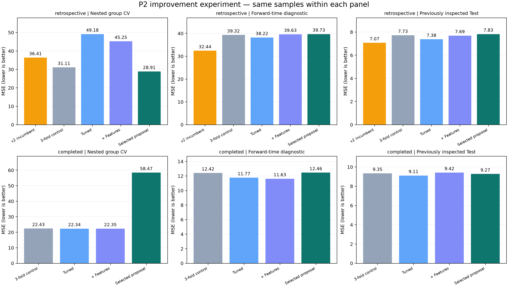

# P2 개선 실험 v1 결과

기존 P2 논문 baseline과 v2 모델을 보존하고, **Bagging/SVR 설정 → 공정·이력 특징 → 결합 방식**을 비교했다.
이 결과는 제안 모델 개발 실험이며 논문 성능의 완전 재현이나 새 독립 데이터 검증이 아니다.
API/Unity 모델은 변경하지 않았다.

**새 제안 모델로 교체하지 않는다.** 그룹 교차검증의 개선이 시간순 검증과 기존 공식 Test에서 일관되게 이어지지 않았다. 기존 P2 모델과 API/Unity 모델을 보존한다.

기존 v2와 같은 이력 방식을 비교하면 중첩 그룹 CV MSE는 36.4062 → 28.9092
(감소율 20.59%)다.
반면 시간순 MSE는 32.4365 → 39.7257,
기존 Test MSE는 7.0743 → 7.8279다.
Test 수치만 좋은 중간 단계를 사후 최종 모델로 바꾸지 않았다.

## 동일 평가 표본에서의 MSE

| policy | model | nested_oof | temporal | validation | test |
|---|---|---|---|---|---|
| completed | control | 22.4289 | 12.4201 | 8.9955 | 9.3458 |
| completed | features | 22.3486 | 11.6294 | 8.8157 | 9.4159 |
| completed | proposed | 58.4657 | 12.4635 | 8.7627 | 9.2730 |
| completed | tuned | 22.3390 | 11.7674 | 8.9303 | 9.1149 |
| retrospective | control | 31.1122 | 39.3240 | 7.6115 | 7.7275 |
| retrospective | features | 45.2465 | 39.6334 | 7.4982 | 7.6943 |
| retrospective | incumbent_refit | 36.4062 | 32.4365 | 6.8277 | 7.0743 |
| retrospective | proposed | 28.9092 | 39.7257 | 7.9788 | 7.8279 |
| retrospective | tuned | 49.1823 | 38.2186 | 7.5285 | 7.3788 |

- `nested_oof`: 원래 Train 1,977건, 5개 바깥 그룹 fold를 합친 MSE. 각 fold 모델의 설정은 해당 학습 부분의 내부 3fold만으로 선택했다. fold별 MSE의 단순 평균이 아니다.
- `temporal`: 과거 1,551건으로 학습해 이후 166건을 평가. 경계를 가로지르는 260건은 이 진단에서 제외했다. 이 166건도 다른 개발 진단에서는 사용된 원래 Train이므로 새 Test가 아니다.
- `validation`/`test`: 각 424건의 이전에 이미 확인한 공식 분할을 최종 선택 후 참고 평가했다.
- `retrospective`: v2와 같은 과거/미래 Train 이웃 라이브러리. 실시간 성능으로 해석하지 않는다.
- `completed`: 예측 공정 시작 전에 완료된 Train 공정의 제거율만 이력으로 사용. 계측값 즉시 확보 가정이며, 실제 계측 지연은 확인되지 않았다. 모델 자체의 시간 방향성은 temporal에서 따로 검사했다.
- `incumbent_refit`: 바깥/시간순 검증에서는 기존 v2 20회 MC CV 절차를 해당 학습 부분에 그대로 재적합했다. 공식 분할에서는 기존 저장 모델 그대로다.
- `control`: 개선 후보와 같은 내부 3fold 그룹 CV를 공유하는 단계 대조군. 20회 MC CV incumbent와 혼동하지 않는다.
- `tuned`: Ridge도 함께 도입한 설정 튜닝. 따라서 이 단계 차이를 Bagging/SVR만의 효과라고 단정하지 않는다.
- `features`: 네 특징 view에서 내부 MSE로 선택; `proposed`: 단독 모델·논문 가중식·OOF 비음수 가중 결합까지 선택.

## 바깥 교차검증의 차이

| policy | reference | reference_mse | proposed_mse | mse_reduction_percent | descriptive_group_bootstrap_delta_low | descriptive_group_bootstrap_delta_high |
|---|---|---|---|---|---|---|
| completed | control | 22.4289 | 58.4657 | -160.6717 | -2.4401 | 121.3686 |
| retrospective | control | 31.1122 | 28.9092 | 7.0808 | -3.9170 | -0.0486 |
| retrospective | incumbent_refit | 36.4062 | 28.9092 | 20.5924 | -12.6544 | -2.2958 |

양의 `mse_reduction_percent`는 개선, 음수는 악화다. 마지막 두 열은 **제안 모델 MSE−대조군 MSE**의 파일 연결 그룹 단위 bootstrap 2.5/97.5 분위수다.
공식 Validation/Test에는 이 연결 그룹 ID가 없으므로 해당 분할의 bootstrap 구간은 산출하지 않았다.
이는 이미 관찰한 데이터와 고정된 OOF 예측의 기술적 불확실성 요약이며, CV 재학습·연구 가설 선택의 불확실성을 포함하는 독립 통계 검정이 아니다.
범위가 0을 포함하면 일관된 개선 근거가 약하다. Test 결과로 후보를 재선정하지 않았다.

## 최종 Train-only 선택

| policy | condition | view | method | models_and_weights |
|---|---|---|---|---|
| completed | Cond1 | both | simplex | persistent=0.0255; knn=0.0000; both/ridge_100=0.5157; both/svr_100_scale_1=0.1559; both/bag_leaf2=0.3029 |
| completed | Cond2 | physics | simplex | persistent=0.0000; knn=0.0000; physics/ridge_100=0.0000; physics/svr_100_scale_0.5=0.2225; physics/bag_leaf2=0.7775 |
| completed | Cond3 | both | simplex | persistent=0.0000; knn=0.0000; both/ridge_100=0.1242; both/svr_10_scale_0.1=0.2935; both/bag_leaf2=0.5823 |
| retrospective | Cond1 | both | simplex | persistent=0.0962; knn=0.0000; both/ridge_100=0.1989; both/svr_10_scale_0.1=0.7049; both/bag_leaf2=0.0000 |
| retrospective | Cond2 | physics | simplex | persistent=0.1492; knn=0.0000; physics/ridge_10=0.0018; physics/svr_1000_0.01_0.1=0.5067; physics/bag_leaf2=0.3423 |
| retrospective | Cond3 | both | simplex | persistent=0.1544; knn=0.2641; both/ridge_100=0.3121; both/svr_10_0.01_0.1=0.1701; both/bag_leaf2=0.0993 |

선택 기준은 내부 OOF MSE, 동점은 후보 ID 사전순이다. 결합 가중치 적합에 사용한 내부 OOF 점수는 낙관적일 수 있어 최종 일반화 성능으로 보고하지 않는다.
최종 전체 Train 적합 모델과 바깥 fold별 모델은 서로 다르다. 가장 좋은 Test seed·모델을 사후에 고르지 않았다.

## 확인한 실패와 다음 실험의 우선순위

완료 이력만 쓰는 제안 모델의 바깥 CV에서 표본 `78f0c2e5cda9415ecec3`의 실제 제거율은
73.1484인데 결합 예측은 -197.0849였다.
이 표본에는 secondary 공정 통계 결측과 학습 분포를 크게 벗어난 primary duration/AUC가 함께 있었다.
Ridge의 선형 외삽이 큰 음수로 이어졌고, 내부 검증에서 정한 결합 가중치가 이를 충분히 억제하지 못했다.
결측만을 단독 원인으로 확정하지 않는다. [성분별 예측·특징 기여 분석](failure_analysis.json)에 근거를 남겼다.

다음 실험에서는 **긴 기록 간격·불완전 공정의 특징 집계 규칙**, 학습 fold 안에서 정한
입력 분포 검사 및 안정적인 fallback, 선형 모델의 외삽과 결합 가중치 제약을 먼저 검증하는 것이 타당하다.
이는 사후 분석으로 제안하는 다음 가설이며 이번 실험에서 검증한 개선 효과가 아니다.
이 표본을 평가에서 지우거나 결과를 본 뒤 예측을 자르는 방식으로 이번 점수를 수정하지 않았다.

## 검증과 재현

- 코드·탐색 범위·입력·분할은 학습 전에 고정: [사전 계획](PROTOCOL.md), [해시](protocol.json).
- [전체 216개 지표](metrics.csv), [fold별 지표](fold_metrics.csv), [조건/Stage별 지표](metrics.csv), [이력 부족·결측별 오차](error_diagnostics.csv).
- [단계별 요약](summary.csv), [대조군 대비 차이](paired_effects.csv), [최종 선택](selection.json), [각 내부 후보 점수·가중치·분할](selection_details).
- [학습 완료와 모델 6개](training_complete.json), [검증 완료](independent_verification.json), [이력 검사](history_audit.json).
- 내부 선택 42개, 지표 216개를 별도 계산으로 확인했다.
  기존 실행 파일 318개의 해시가 동일함을 확인했다.
- 최종 모델은 `cmp_ml.improvement_models.ImprovementBundle.predict_all(frame)`으로 네 단계 예측을 제공한다.
  입력은 원시 CSV가 아니라 기존 P2 특징 추출 결과이며, 이력 조회에 필요한 wafer/condition/machine/start/end가 있어야 한다.
  모델 파일은 신뢰하는 이 저장소의 파일만 joblib로 읽는다.

실행 명령과 입력 준비는 [실험 문서](../../docs/p2-improvement-v1.md)를 따른다. 원시 데이터와 전체 외부 fold 모델 캐시는 Git에 게시하지 않는다.
