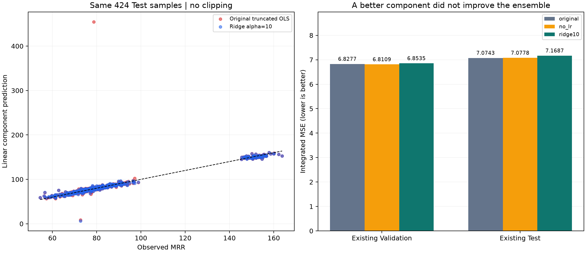

# P2 큰 오차와 선형회귀 영향 진단

**진단과 사전에 고정한 세 가지 비교를 완료했다. LR 자체의 극단 오차를 줄여도 통합 모델의 기존 Test 성능은 개선되지 않았다.**
기존 논문 재현 baseline과 API/Unity 모델을 유지한다. 이전 데이터를 이미 확인한 후속 개발 실험이며 새 독립 검증이 아니다.

## 핵심 결과

- 통합 모델의 기존 Test MSE: 기존 **7.0743**, LR 제거 **7.0778**,
  Ridge 교체 **7.1687**. 값이 낮을수록 좋다.
- 선형 모델 단독 Test MSE는 **351.1079 → 17.6054**로 낮아졌다.
  하지만 통합 가중치까지 달라져 전체 예측은 개선되지 않았다.
- Cond1에서는 새 선형 모델의 CV 오차가 낮아져 통합 가중치가 약 **9.22%**로 커졌다.
  이 조건의 통합 Test MSE는 **6.2085 → 6.4626**로 악화됐다.
  Cond3의 작은 개선보다 Cond1의 악화가 컸다. 계수 안정화와 전체 성능 개선은 같은 결과가 아니다.
- 기존 Cond1 LR 가중치는 **5.37265678e-07**, Cond2는 **1.10778405e-08**다.
  이 두 조건에서 LR은 이미 거의 배제되어 있었다. Cond3 가중치는 **0.018390**다.
- 원래 통합 모델에서 오류 상위 10건이 전체 Test 제곱오차의 **31.40%**를 차지한다.
  그중 **10/10건**은 정답이 LR을 제외한 네 구성 모델 예측의 최솟값–최댓값 밖에 있다.
  이 표본들에서는 네 모델의 비음수 가중치만 바꿔 정답에 도달할 수 없다. 실제 오차 감소 정도는 별도 검증이 필요하다.

## 동일한 평가에서의 비교

| model | nested_oof | temporal | validation | test |
|---|---|---|---|---|
| no_lr | 36.3565 | 32.4387 | 6.8109 | 7.0778 |
| original | 36.4062 | 32.4365 | 6.8277 | 7.0743 |
| ridge10 | 36.3528 | 32.4276 | 6.8535 | 7.1687 |

`nested_oof`: 같은 파일/웨이퍼 연결 그룹 바깥 5fold 1,977건.
`temporal`: 학습 1,551건, 이후 평가 166건, 경계 제외 260건.
Validation/Test는 기존 공식 분할 각각 424건이다. 같은 데이터·행·조건으로 계산했다.
미래 Train 이웃도 허용하는 기존 논문 비교 정책을 유지했으므로 completed 이력 정책의 robust v2 Test 8.9491과 직접 순위를 매기지 않는다.

| evaluation | procedure | original_mse | candidate_mse | relative_mse_change_percent |
|---|---|---|---|---|
| nested_oof | no_lr | 36.4062 | 36.3565 | -0.1363 |
| nested_oof | ridge10 | 36.4062 | 36.3528 | -0.1465 |
| temporal | no_lr | 32.4365 | 32.4387 | 0.0068 |
| temporal | ridge10 | 32.4365 | 32.4276 | -0.0273 |
| test | no_lr | 7.0743 | 7.0778 | 0.0486 |
| test | ridge10 | 7.0743 | 7.1687 | 1.3336 |
| validation | no_lr | 6.8277 | 6.8109 | -0.2467 |
| validation | ridge10 | 6.8277 | 6.8535 | 0.3786 |

변화율은 `(후보 MSE / 기존 MSE - 1) × 100`이며 양수는 악화다. MSE를 정확도 또는 오차율 %로 부르지 않는다.
[그룹 재표집 구간](paired_effects.csv)은 이미 고정된 예측을 2,000회 재표집한 기술적 요약이며 독립 확인 검정이 아니다.
바깥 그룹·시간순에서 작은 감소가 있어도 기존 Test의 개선을 보장하지 않았다. Test에서 후보를 재선정하지 않았다.

## 어떤 변경만 했는가

| 절차 | 변경 |
|---|---|
| original | 원래 재현 v2 모델, 특징과 가중치 그대로 |
| no_lr | LR 가중치만 0, 다른 네 가중치를 비례 재정규화 |
| ridge10 | LR만 Ridge(alpha=10)로 교체하고 같은 CV 오차 가중식을 다시 계산 |

기존 SVR·Bagging·Persistent·KNN, 모든 부모 학습 집합, 특징 선택표를 유지했다.
Ridge alpha는 결과를 보기 전에 10으로 고정했으며 탐색하지 않았다. 범위 제한이나 표본 삭제도 추가하지 않았다.
21개 부모 적합 × 20개 기존 CV 분할에서 LR을 다시 적합해 기존 CV 오차와 같음을 확인하고 Ridge만 새로 적합했다.
내부 CV는 원래 wafer 그룹 무작위 분할이며 파일 그룹 분리나 시간순 조건을 새로 추가하지 않았다.
내부 검증 표본은 반복 간 겹칠 수 있어 독립 20개 검증으로 해석하지 않는다.
가중치는 CV 오차로 정하며 공식 Validation/Test로 정하지 않았다. Ridge의 가중치 변화까지 포함한 결합 효과다.

## 선형회귀는 왜 크게 틀렸는가

| condition | selected_features | retained_rank | effective_condition_number | high_correlation_pairs | max_abs_ols_coefficient | max_abs_ridge_coefficient |
|---|---|---|---|---|---|---|
| Cond1 | 91 | 88 | 573285.0314 | 26 | 5504.1763 | 2.8053 |
| Cond2 | 86 | 82 | 284416.8091 | 20 | 3830.5011 | 3.4853 |
| Cond3 | 54 | 49 | 723556.2189 | 29 | 19952.2973 | 1.3893 |

선택 특징 사이에 절댓값 상관이 0.9999를 넘는 쌍들이 있고, 사용량 표준편차·감소 기울기 등에서 큰 양·음 계수가 상쇄되는 구조를 확인했다.
이미 표준화와 SVD 절단(rcond=1e-6)을 적용한 모델이다. 유효 조건수는 절단 후 남은 최대/최소 특이값의 비이며,
이 값 하나로 모든 예측 오류의 원인을 확정하지 않는다. Ridge의 계수 크기는 크게 작아졌지만 일부 평가에서 단독 성능은 악화됐다.

가장 큰 LR Test 오류 표본은 `d5781eb69b823c502bd1` (wafer `-903170120`, Cond1)다.
실측 **78.6405**, LR **454.6521**, 통합 **78.9667**, LR 제거 통합 **78.9665**다.
이 한 표본이 LR 전체 Test 제곱오차의 **94.97%**다.
즉 LR 단독의 큰 오차가 그대로 통합 예측에 전달된 것은 아니다.

Ridge에서도 남는 큰 오류 표본 `515dc65b92ddc1fcd0a3`는 실측 **72.6599**,
Ridge **6.3917**, 기존 통합 **71.4291**다.
선택 특징 중 10개가 학습 최솟값–최댓값 밖이고,
표준화된 입력의 최대 절댓값은 **110.78**다.
계수 크기를 줄이는 것만으로 학습 범위 밖 입력의 잘못된 외삽까지 해결되지는 않았다.

[특징별 계수·스케일](coefficients.csv), [높은 상관 쌍](high_correlation_pairs.csv),
[큰 오류 표본의 전체 선형 기여](tail_linear_contributions.csv).
기여는 표준화 입력 × 계수이며 절편과 합치면 저장 LR 예측이 복원됨을 확인했다. 물리적 인과 영향으로 해석하지 않는다.

| condition | test_n | LR_MSE | Ridge_MSE | original_MSE | no_lr_MSE | ridge10_MSE | max_abs_no_lr_change |
|---|---|---|---|---|---|---|---|
| Cond1 | 165 | 890.2791 | 33.3940 | 6.2085 | 6.2085 | 6.4626 | 0.0002 |
| Cond2 | 186 | 6.5615 | 6.5232 | 6.7884 | 6.7884 | 6.7884 | 0.0000 |
| Cond3 | 73 | 10.3184 | 10.1558 | 9.7598 | 9.7798 | 9.7336 | 0.0668 |

작은 LR 가중치를 4자리 반올림하면 0으로 보이므로 실제 정밀값은 [가중치 CSV](component_weights.csv)에 보존했다.

## 통합 모델의 상위 오류 10건

| sample_id | condition | truth | original | error | P2_LR | no_lr | ridge10 | truth_outside_non_lr_prediction_range |
|---|---|---|---|---|---|---|---|---|
| 7d28fc108c3d1fcb0fdc | Cond1 | 56.6146 | 69.1166 | 12.5020 | 70.3311 | 69.1166 | 69.2581 | True |
| f87bd15cfe0b9c9d8415 | Cond2 | 97.1098 | 84.7766 | -12.3333 | 102.4803 | 84.7766 | 84.7766 | True |
| 98cba2b96f73f2b35fd6 | Cond1 | 62.7504 | 74.1782 | 11.4278 | 75.3380 | 74.1782 | 74.3124 | True |
| ab96c5ed8e6752b4b9c8 | Cond3 | 163.7971 | 152.5954 | -11.2018 | 152.9359 | 152.5890 | 152.6380 | True |
| d2ba0a012398f74e2ef8 | Cond2 | 72.9412 | 81.7403 | 8.7991 | 79.4904 | 81.7403 | 81.7403 | True |
| a46bebf8e9f512a996be | Cond3 | 154.6929 | 146.4065 | -8.2864 | 145.8301 | 146.4173 | 146.2922 | True |
| 2bee269ffc1783adc8f9 | Cond2 | 78.1261 | 86.1466 | 8.0205 | 84.3873 | 86.1466 | 86.1466 | True |
| 566de29f17b444f9d704 | Cond2 | 93.8781 | 86.0348 | -7.8433 | 89.0375 | 86.0348 | 86.0348 | True |
| 921e4c621638d9799d22 | Cond3 | 162.2781 | 154.5918 | -7.6863 | 156.0402 | 154.5647 | 154.7519 | True |
| e441cea6e33ad005e714 | Cond2 | 73.4654 | 66.6476 | -6.8177 | 65.4217 | 66.6476 | 66.6476 | True |

상위 표본은 기존 Test 오차로 고른 **진단용 부분집합**이다. 이 표본에 맞춰 모델을 선택하거나 삭제하지 않았다.
그중 primary 구간 모호성은 6건, secondary 누락은 0건이다.
이 표시만으로 원인이 밝혀진 것은 아니다. 공정 로그 구간과 실측 제거율이 물리적으로 정확히 대응하는지는 여전히 확인이 필요하다.

| subset | n | primary_ambiguous_n | primary_ambiguous_fraction | truth_outside_non_lr_range_n |
|---|---|---|---|---|
| test_top10 | 10 | 6 | 0.6000 | 10 |
| test_remaining | 414 | 80 | 0.1932 | 214 |
| test_all | 424 | 86 | 0.2028 | 224 |
| validation_all | 424 | 91 | 0.2146 | 231 |

모호한 primary 구간의 비율은 상위 10건에서 60%, 전체 Test에서 약 20.3%다.
점검 우선순위를 정하는 관찰이며, 오류로 고른 부분집합이므로 인과 효과나 독립적인 통계 검정으로 해석하지 않는다.

[전체 848개 평가 표본 진단](sample_diagnostics.csv)에 구성 예측·LR 제거 변화·입력 범위 이탈·이력 가용량·품질 표시를 기록했다.
[상위 통합 오류와 상위 LR 오류의 이력 참조 ID/시각](tail_history_references.csv)은 원래 선택된 참조를 추적한다.
`references_not_completed`는 원래 사후 분석 정책에서 허용한 참조이며 이번에 새로 유입된 평가 정답이 아니다.
이 정책을 공정 종료 직후 실시간 운영 조건과 동일하다고 주장하지 않는다.

## 판단과 다음에 필요한 근거

이번 결과는 **LR 개선만으로 통합 오차를 줄일 수 있다는 가설을 지지하지 않는다**.
현재 논문 비교 모델을 유지하고, 남은 오류에서 구성 모델들이 함께 과소/과대 예측하는 공정·이력 구간을 확인하는 것이 다음 과제다.
공정 구간/계측 대응이나 새 시점 자료 없이 Test 최저점을 쫓는 추가 튜닝은 수행하지 않았다.
P1/P3 baseline과 이전 실험은 수정하지 않았다.

## 검증과 재현

- 이전 파일 844개 해시 보존, 원래 모든 바깥/최종 통합 예측 동일 재현.
- 지표 216행 독립 재계산, 내부 CV 420개 대조.
- 저장 모델 재로딩·조회 정답/순서 변경 불변성 24개 블록 확인.
- [사전 계획](PROTOCOL.md), [고정 설정](configuration.json), [모델 파일](training_complete.json),
  [검증 결과](independent_verification.json), [테스트](tests.json), [산출물 해시](artifact_manifest.json).
- [실행 방법](../../docs/p2-lr-diagnosis-v1.md). 원시 로그와 중간 모델 캐시는 Git에 포함하지 않는다.
- 저장된 `LRBundle.predict_all(frame)`은 원래 5개 구성 예측, Ridge 예측 및 세 통합 절차의 예측을 반환한다.

