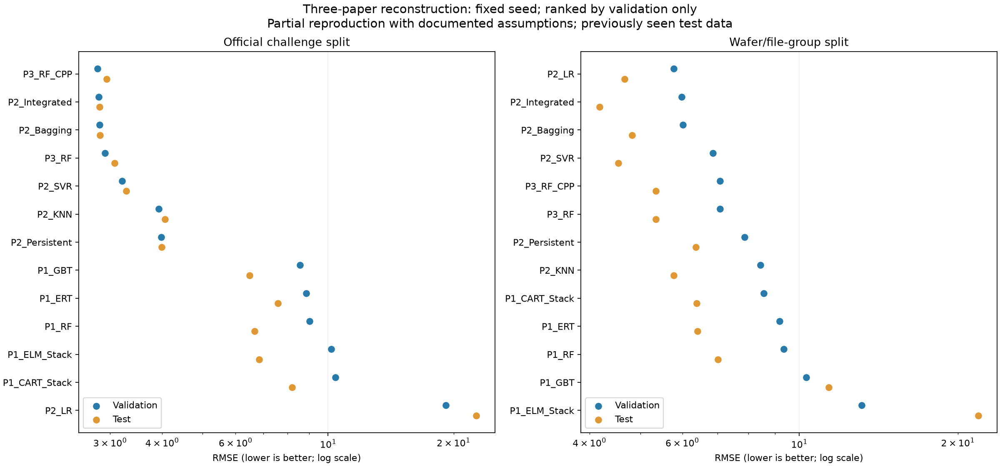

# 세 논문 기반 PHM CMP 재현 결과

**판정: 명시 조건 구현 + 미기재 조건을 공개한 부분 재현. 저자 수치의 완전 재현은 아니다.**

[원문 대응·수식·설정·가정](PROTOCOL.md). 원문 PDF는 재배포하지 않으며 파일 해시는 paper_sources.json에 기록했다.

공통 그룹 분할의 Validation MSE로 선택한 최종 연구 후보: **P2_LR**. 기존 API/Unity 모델을 자동 교체하지 않았다.

이전 실험에서 이미 확인한 Test를 재사용했다. 이 결과를 새로운 독립 Test나 새 공장/미래 시점의 검증이라고 부르지 않는다.

## official 분할

표본 수: {'train': 1977, 'validation': 424, 'test': 424}. 선택 모델: **P3_RF_CPP**. 표는 미리 고정한 seed 20260917의 결과다.

| 모델 | Validation MSE | Test MSE | Test RMSE | Test MAE | Test R² |
|---|---:|---:|---:|---:|---:|
| P3_RF_CPP | 7.8327 | 8.6851 | 2.9470 | 2.1932 | 0.9901 |
| P2_Integrated | 7.9317 | 8.0058 | 2.8295 | 2.0957 | 0.9908 |
| P2_Bagging | 8.0021 | 8.0425 | 2.8359 | 2.0919 | 0.9908 |
| P3_RF | 8.5132 | 9.4774 | 3.0785 | 2.3208 | 0.9892 |
| P2_SVR | 10.2629 | 10.7701 | 3.2818 | 2.4062 | 0.9877 |
| P2_KNN | 15.4244 | 16.4924 | 4.0611 | 3.0802 | 0.9811 |
| P2_Persistent | 15.8617 | 15.9013 | 3.9876 | 3.0126 | 0.9818 |
| P1_GBT | 73.4376 | 42.0792 | 6.4868 | 3.9751 | 0.9518 |
| P1_ERT | 78.7069 | 57.4199 | 7.5776 | 4.6148 | 0.9343 |
| P1_RF | 81.6753 | 44.4745 | 6.6689 | 4.2084 | 0.9491 |
| P1_ELM_Stack | 103.4607 | 46.7379 | 6.8365 | 4.0298 | 0.9465 |
| P1_CART_Stack | 108.2612 | 67.3350 | 8.2058 | 4.9124 | 0.9229 |
| P2_LR | 367.8588 | 512.7747 | 22.6445 | 3.5215 | 0.4132 |

Test 순위가 Validation 순위와 달라도 재선정하지 않는다. Stage별·RE·MAPE·두 S-score는 metrics.csv에 있다.

## grouped 분할

표본 수: {'train': 1177, 'validation': 297, 'test': 296}. 선택 모델: **P2_LR**. 표는 미리 고정한 seed 20260917의 결과다.

| 모델 | Validation MSE | Test MSE | Test RMSE | Test MAE | Test R² |
|---|---:|---:|---:|---:|---:|
| P2_LR | 33.3632 | 21.7463 | 4.6633 | 3.6589 | 0.9720 |
| P2_Integrated | 35.7392 | 17.4973 | 4.1830 | 3.1882 | 0.9775 |
| P2_Bagging | 36.1786 | 23.2324 | 4.8200 | 3.5316 | 0.9701 |
| P2_SVR | 46.9725 | 20.5769 | 4.5362 | 3.6277 | 0.9735 |
| P3_RF_CPP | 50.0065 | 28.5758 | 5.3456 | 4.0824 | 0.9632 |
| P3_RF | 50.0065 | 28.5758 | 5.3456 | 4.0824 | 0.9632 |
| P2_Persistent | 62.0848 | 40.4538 | 6.3603 | 5.2723 | 0.9479 |
| P2_KNN | 71.1698 | 33.4123 | 5.7803 | 4.5532 | 0.9570 |
| P1_CART_Stack | 73.2262 | 40.8162 | 6.3888 | 4.9417 | 0.9475 |
| P1_ERT | 84.2605 | 41.0660 | 6.4083 | 4.3985 | 0.9471 |
| P1_RF | 87.3731 | 49.1464 | 7.0105 | 4.7605 | 0.9367 |
| P1_GBT | 106.1493 | 129.5842 | 11.3835 | 5.4029 | 0.8332 |
| P1_ELM_Stack | 172.3333 | 477.8832 | 21.8605 | 6.1401 | 0.3850 |

Test 순위가 Validation 순위와 달라도 재선정하지 않는다. Stage별·RE·MAPE·두 S-score는 metrics.csv에 있다.

## 논문 수치와의 대조

| 원문 | 발표한 Test 수치 | 이번 대조 범위 |
|---|---|---|
| P1 Table 7–8 | CART RMSE A=5.065/B=4.500; ELM A=4.795/B=4.485 | official Stage별 RMSE. ELM/CART 미기재 설정과 집계 차이 때문에 동일 재현으로 단정 불가 |
| P2 Table 5 | Integrated MSE=7.07, Persistent=8.23, KNN=9.60, SVR=7.44, LR=7.32, Bagging=7.22 | official 전체 MSE. 과거 실측 이력의 사용 가능성·CV·모델 설정 미기재 |
| P3 Table II | RF MSE=7.6, CPP revised RF=7.4 | official 전체 MSE. GA 과정 미재현, 최종 subset만 구현, phase 규칙 근사 |

이 표의 발표 수치는 학습의 목표값이나 선정 기준으로 사용하지 않았다. 논문의 MSE를 정확도(%)로 바꾸지 않는다.

## 반복·무결성·한계

- P1: Stage별 20회 seed 반복, 각 반복에서 5-fold stacking. p1_repeat_metrics.csv는 반복별 지표, p1_repeated_predictions.csv.gz는 예측이다.
- P2: condition별 20회 Monte Carlo CV, fold 안에서 이력·선택·전처리 재계산. *_cv.csv와 *_feature_votes.csv에 근거를 기록했다.
- P3: 논문의 최종 11/6개 특징과 CPP 보정 구현. 전체 GA/47개 후보 탐색의 재현을 주장하지 않는다.
- 원래 대회 분할에서 Train과 동일 wafer가 validation 115개, test 113개 존재한다(다른 Stage).
- 네 극단 제거율의 공통 제외는 P1 조건이며 P2/P3에는 추가 가정이다. 그 극단값을 예측하는 모델로 검증되지 않았다.
- P2의 이웃/과거 정답과 P3 보정은 각 학습 라이브러리에서만 사용한다. holdout 정답을 입력으로 사용하지 않는다.
- P3의 ID·절대시각 입력과 label-free 전체 CPP 구조는 원문에 가까운 내삽 환경이다. 일반적인 신규 웨이퍼 온라인 추론의 보증이 아니다.
- P1 수식 오기/집계 불명확성 때문에 표준 R²와 literal/exp-1 S-score를 분리했다.
- 저장 모델 재로딩 비교와 특징/분할/선정/예측 해시는 verification.json, protocol.json, evaluation_seal.json에 있다.

## 원문 대조 및 재현 진단

- [특징 번호 대응표](feature_catalog.csv): P1 Appendix F1–F35, P2 Table 3의 1–125, P3 Table III의 11/6개를 코드 컬럼에 연결한다.
- [논문 발표값 대조](paper_comparison.csv): P1 Stage별 RMSE/R²/RE, P2/P3 MSE를 각각 비교한다. S-score는 집계 불명확성을 유지해 직접 차이를 비워 두었다.
- [실제 라이브러리 설정](implementation_parameters.json): 저장 모델에서 get_params로 읽은 설정이다. 원문이 명시한 값인지 여부는 PROTOCOL.md와 함께 본다.
- [최종 후보 파일](final_candidate.json): 선택된 모델군의 실제 학습 파일과 해시. 입력에 이력/CPP 문맥이 필요한 모델은 단순 시나리오 슬라이더로 대체할 수 없다.
- P3의 원문은 2,929 runs/1,267 CPP를 적고 있으나 확보한 데이터는 2,829 wafer-stage이고 구현의 CPP는 1014개이다. CPP 구성 규칙이 완전히 일치한 재현이 아니다.
- P3의 primary chamber 유효 phase 판정에 쓸 양수 신호가 없어 전체 primary 구간을 사용한 표본은 438개이다. 물리 구간 판정의 한계를 감추지 않는다.
- P3의 wafer/CPP ID 인코딩은 원문에 없어 코드에 고정한 원래 수치값을 사용했다. ID 순서가 물리량이라는 가정을 검증한 것은 아니다.
- P2_LR는 grouped Validation의 선정 기준을 만족했지만 official에서 큰 개별 오차가 있다. 이 분할 의존성과 선형 외삽 위험 때문에 모든 환경에서 최고인 모델이라고 추천하지 않는다. Test를 본 뒤 후보를 바꾸지는 않았다.

