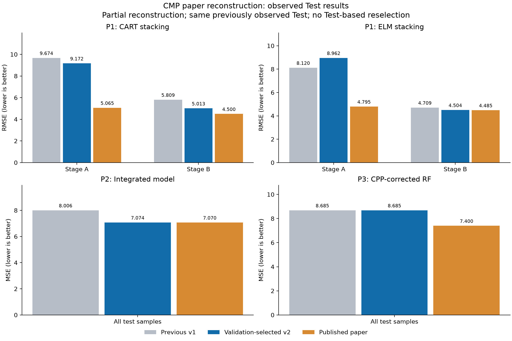

# 논문 조건 차이 검증 v2: 결과 요약

**2번 통합 모델은 Test MSE 8.0058 → 7.0743으로 11.64% 개선했다.** 논문 발표값 7.07과 소수 둘째 자리까지 같지만, 저자 코드·설정·전처리를 완전히 복원했다는 증거는 아니다. 특히 P2의 개별 LR는 여전히 큰 오차를 보인다. 전체 방법의 완전 재현으로 보고하지 않는다.

| 대표 모델 | v1 Test MSE | v2 Test MSE | 판정 |
|---|---:|---:|---|
| P1 CART stacking | 67.3350 | 58.2447 | 13.50% 감소 |
| P1 ELM stacking | 46.7379 | 53.9847 | 15.51% 증가 |
| P2 Integrated | 8.0058 | 7.0743 | 11.64% 감소 |
| P3 RF_CPP | 8.6851 | 8.6851 | Validation 기준 기존 설정 유지 |

이 표는 사전에 정한 seed 0의 저장 모델 결과이다. MSE 감소율은 예측 정확도 %가 아니다. [전체 13개 모델·Stage별 원문 대조](REPORT.md), [모든 비교 지표](comparison.csv), [저자 발표값과 대조](paper_comparison.csv)를 함께 본다.

## 무엇을 확인했나

- **P1:** Stage별 CART/ELM 후보를 Validation으로 선택했다. CART는 Test에서도 개선됐다. ELM은 Stage B RMSE가 4.7092 → 4.5035로 개선됐지만 Stage A는 8.1199 → 8.9624로 악화해 전체 Test MSE가 증가했다. Test를 본 뒤 원래 ELM로 바꾸거나 좋은 Stage만 보고하지 않았다.
- **P2:** 네 극단 Train 표본을 포함하는 대조군은 Validation MSE가 7.9317 → 1,428.4912로 악화했다. 포함이 저자의 실제 처리라고 확정할 수 없다. 최종적으로 제외를 유지하고 raw usage Euclidean 거리·이전 시작 기준 lag·SVD 절단 OLS를 사용하는 후보가 Validation MSE 6.8277로 선정됐다. 이 수정 묶음의 개선을 개별 수정 하나의 효과로 단정하지 않는다.
- **P2의 남은 차이:** 통합 모델은 논문 MSE에 근접했지만 LR Test MSE는 351.1079로 논문 7.32와 매우 다르다. SVR·이웃 모델 등도 동일 성능 재현이 아니다. 과거 MRR의 실제 측정 가능 시점과 저자의 feature selection을 확인하지 못했다. 통합 결과만으로 전체 재현 성공을 주장하지 않는다.
- **P3:** Figure III를 참고한 center pressure·슬러리·회전 구간과 Stage별 CPP를 시험했다. CPP 수는 해석에 따라 1,240/1,291개이며 원문의 1,267개와 다르다. 이 조건들은 Validation에서 기존 7.8327을 개선하지 못해 기존 모델을 유지했다. CPP 개수가 원문에 가까워진 것만으로 예측이 좋아지는 것은 아니었다.

## 반복 실험과 일반화 범위

P1의 20개 seed 평균 Test MSE는 CART 62.4665 → 54.8128, ELM 52.5643 → 50.9558이었다. ELM의 반복 평균은 소폭 낮아졌지만 주 저장 모델(seed 0)의 악화를 이 평균으로 대체하지 않는다. 반복 표준편차와 Stage별 결과는 [반복 통계](p1_repeat_summary.csv), 이전과의 평균 비교는 [반복 비교](repeat_comparison.csv)에 있다. 같은 데이터의 난수 반복이므로 새로운 독립 표본 평가나 통계적 우월성 확정은 아니다.

모든 후보·코드를 먼저 고정하고, Train/Validation으로 선택한 후 Test 정답을 별도 평가 명령에서 읽었다. 다만 이 Test는 이미 이전 실험에서 확인한 자료이며 이번 가설 설정에도 그 과거 결과가 영향을 주었다. **새 공장·미래 시점·독립 Test에 대한 개선으로 해석하지 않는다.** P2의 `prior_start`는 아직 완료되지 않은 과거 시작 run의 실측값을 사용할 수도 있는 사후 분석 가정이어서 실시간 서비스의 데이터 가용성 검증이 필요하다.

## 코드·모델·검증

- [실행 전 고정한 근거와 후보](PROTOCOL.md), [선택 결과](selection.json), [모든 Validation 후보](validation_trials.csv)
- [학습 완료·모델 해시](training_complete.json): P1 Stage A/B, P2 Cond1/2/3, P3 route 456/123의 7개 저장 묶음
- [재로딩·기존 모델 보존](verification.json), [독립 지표·이력·가중치 확인](independent_verification.json), [실제 모델 설정](implementation_parameters.json), [테스트 결과](tests.json)
- 이전 논문 모델 14개와 기존 배포 후보 모델 26개의 해시를 보존했다. API/Unity에 자동 적용하지 않았다.
- 전체 학습·평가 재현 명령은 [실험 안내](../../docs/paper-reconstruction-v2.md)에 있다. 원본 시계열과 전체 특징 캐시는 로컬 전용이다.
