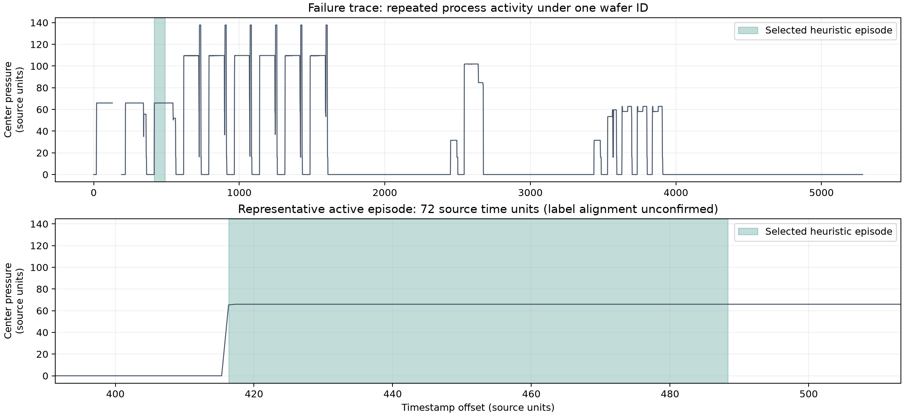
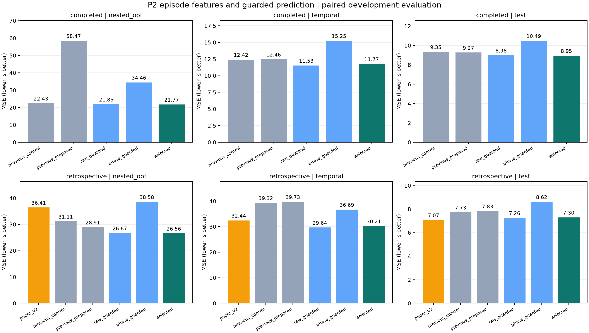

# P2 구간 정제·입력 보호 실험 v2

이전 실패 분석에 따라 입력 구간과 예측 보호 규칙을 바꾼 후속 개발 실험이다.
원래 논문 baseline과 이전 모델·결과를 보존했다. API/Unity 모델은 교체하지 않았다.
이전 Test와 외부 fold 결과를 보고 가설을 세웠으므로 **새 독립 데이터 검증이 아니다**.

과거에 완료된 공정의 이력만 쓰는 `completed` 조건에서 기존 안정 대조군 대비 MSE가
그룹 검증 22.4289 → **21.7694 (2.94% 감소)**, 시간순 검증 12.4201 → **11.7714 (5.22% 감소)**,
기존 Test 9.3458 → **8.9491 (4.24% 감소)**로 낮아졌다. 이 감소율은 MSE의 상대 변화이며 정확도나 오차율 자체가 아니다.
그룹·시간순 검증의 대응 MSE 차이 재표집 구간은 각각 [-3.0949, 0.9520], [-1.4515, 0.3480]으로 0을 포함한다.
따라서 관측된 개선은 있으나 우월성이 확정됐다고 해석하지 않는다.

논문 비교용 `retrospective` 조건의 Test는 기존 P2 **7.0743**에서 새 절차 **7.2980**으로 악화됐다.
이 조건의 기존 최고 모델은 유지한다. 두 이력 정책의 수치를 섞어 순위를 매기지 않는다.
대표 활성 구간만 쓰는 `phase_guarded`는 전체 그룹 검증에서 오히려 나빠져, 구간을 짧게 고르는 것이 보편적인 해법은 아니었다.
결측·범위 초과 입력을 처리하고 여러 집계 후보를 내부 검증으로 선택한 절차의 결과로 해석한다.

## 동일 표본에서의 MSE

| policy | model | nested_oof | temporal | validation | test |
|---|---|---|---|---|---|
| completed | gap_guarded | 21.6275 | 11.7714 | 8.5651 | 9.0272 |
| completed | phase_guarded | 34.4577 | 15.2524 | 10.0315 | 10.4905 |
| completed | previous_control | 22.4289 | 12.4201 | 8.9955 | 9.3458 |
| completed | previous_proposed | 58.4657 | 12.4635 | 8.7627 | 9.2730 |
| completed | raw_guarded | 21.8513 | 11.5318 | 8.5274 | 8.9836 |
| completed | raw_unprotected | 22.0828 | 11.7591 | 8.9364 | 8.9768 |
| completed | selected | 21.7694 | 11.7714 | 8.5402 | 8.9491 |
| retrospective | gap_guarded | 26.5643 | 30.5492 | 7.2940 | 7.2980 |
| retrospective | paper_v2 | 36.4062 | 32.4365 | 6.8277 | 7.0743 |
| retrospective | phase_guarded | 38.5848 | 36.6883 | 8.7226 | 8.6209 |
| retrospective | previous_control | 31.1122 | 39.3240 | 7.6115 | 7.7275 |
| retrospective | previous_proposed | 28.9092 | 39.7257 | 7.9788 | 7.8279 |
| retrospective | raw_guarded | 26.6673 | 29.6433 | 7.3423 | 7.2575 |
| retrospective | raw_unprotected | 29.3501 | 33.0484 | 7.7717 | 7.6971 |
| retrospective | selected | 26.5642 | 30.2146 | 7.2940 | 7.2980 |

`completed`는 공정 종료 전후를 지켜 과거 Train 제거율만 이력으로 사용한다. 즉시 계측 가능 가정이며 실측 지연은 미확인이다.
`retrospective`는 미래 Train 이웃을 허용하는 이전 P2 비교 조건이다. 온라인 예측 성능으로 해석하지 않는다.
`nested_oof`는 동일한 1,977건의 5fold 바깥 예측을 합친 MSE이고, 시간순 진단은 1,551건 학습/166건 평가/260건 경계 제외다.
기존 Validation/Test 각 424건은 최종 설정을 고정한 뒤 참고용으로 평가했다.

`previous_control`/`previous_proposed`는 이전 improvement v1 예측 그대로,
`paper_v2`는 당시 동일 outer/time 학습 부분에 재적합한 P2 v2와 공식 분할의 저장 모델이다.
이번 `raw_unprotected`는 125개 전체 특징과 새로 고정한 9개 회귀 설정을 쓰므로 이전 모델과 동일하지 않다.
`raw_guarded`와 비교하면 입력/예측 보호 묶음의 효과를 볼 수 있고, 보호된 raw/gap/phase 사이에서는 집계 규칙을 비교한다.
`selected`는 각 학습 부분의 내부 OOF MSE로 보호된 후보 셋 중 선택한 절차다. Test로 다시 고르지 않았다.

## 이전 기준선 대비

| evaluation | policy | reference | reference_mse | selected_mse | mse_reduction_percent |
|---|---|---|---|---|---|
| nested_oof | completed | previous_control | 22.4289 | 21.7694 | 2.9401 |
| nested_oof | retrospective | paper_v2 | 36.4062 | 26.5642 | 27.0338 |
| temporal | completed | previous_control | 12.4201 | 11.7714 | 5.2226 |
| temporal | retrospective | paper_v2 | 32.4365 | 30.2146 | 6.8500 |
| test | completed | previous_control | 9.3458 | 8.9491 | 4.2449 |
| test | retrospective | paper_v2 | 7.0743 | 7.2980 | -3.1616 |
| validation | completed | previous_control | 8.9955 | 8.5402 | 5.0618 |
| validation | retrospective | paper_v2 | 6.8277 | 7.2940 | -6.8289 |

양의 감소율은 개선, 음수는 악화다. 표본 수·시간 조건이 다른 평가의 숫자를 직접 비교하지 않는다.
[전체 대응 비교](paired_effects.csv)의 delta_low/high는 고정 예측을 파일 연결 그룹으로 재표집한 기술적 구간이며
새 독립 통계 검정이 아니다. 외부 공식 분할은 파일 연결 그룹 ID가 없어 구간을 산출하지 않았다.

## 이전 실패 표본 유지

| policy | model | truth | prediction | absolute_error |
|---|---|---|---|---|
| retrospective | raw_unprotected | 73.1484 | 50.2168 | 22.9316 |
| retrospective | raw_guarded | 73.1484 | 82.2189 | 9.0705 |
| retrospective | gap_guarded | 73.1484 | 82.5738 | 9.4254 |
| retrospective | phase_guarded | 73.1484 | 83.1766 | 10.0282 |
| retrospective | selected | 73.1484 | 82.5738 | 9.4254 |
| completed | raw_unprotected | 73.1484 | 76.7142 | 3.5658 |
| completed | raw_guarded | 73.1484 | 73.0026 | 0.1458 |
| completed | gap_guarded | 73.1484 | 73.2165 | 0.0681 |
| completed | phase_guarded | 73.1484 | 82.5522 | 9.4038 |
| completed | selected | 73.1484 | 73.2165 | 0.0681 |
| retrospective | previous_control | 73.1484 | 82.3011 | 9.1527 |
| retrospective | previous_proposed | 73.1484 | 53.4575 | 19.6909 |
| completed | previous_control | 73.1484 | 75.2145 | 2.0661 |
| completed | previous_proposed | 73.1484 | -197.0849 | 270.2333 |
| retrospective | paper_v2 | 73.1484 | 82.3741 | 9.2257 |

이 표본에는 같은 wafer ID/chamber 4로 여러 활성 구간과 대기가 기록됐다. 원시 5,205행의 전체 시간 범위는 5,283,
최대 기록 간격은 63이었다. 한 번의 긴 결측 구간만이 원인은 아니다. 재작업인지 ID 기록 문제인지,
어느 연마 구간이 실측 제거율에 대응하는지는 확인되지 않았다. 최장 활성 구간은 공개한 가정이다.
이 표본은 학습/평가에서 제거하지 않았으며 새 규칙은 타깃을 보지 않고 모든 표본에 동일하게 적용했다.

[원시 기록 확인](raw_failure_audit.json)과 아래 그림은 반복된 압력 동작 및 대표 구간을 보여준다.

## 대체 예측 빈도와 최종 설정

| evaluation | policy | n | fallback_n | fallback_fraction |
|---|---|---|---|---|
| nested_oof | completed | 1977 | 403 | 0.2038 |
| nested_oof | retrospective | 1977 | 401 | 0.2028 |
| temporal | completed | 166 | 35 | 0.2108 |
| temporal | retrospective | 166 | 35 | 0.2108 |
| test | completed | 424 | 88 | 0.2075 |
| test | retrospective | 424 | 88 | 0.2075 |
| validation | completed | 424 | 91 | 0.2146 |
| validation | retrospective | 424 | 91 | 0.2146 |

품질이 모호하거나 물리 특징의 결측/범위 초과가 감지되면 해당 학습 fold에서 선택한 Bagging 예측을 사용했다.
대체가 많으면 최종 결과는 상당 부분 트리 모델의 성능을 반영한다. 이는 입력이 정상임을 인증하는 기능이 아니다.
개별 선형/SVR 예측이 학습 y 범위를 벗어날 때의 성분 대체도 별도로 적용한다.
위 표는 전체 결합을 트리로 바꾼 횟수이고, 성분 대체 횟수와 혼동하지 않는다.
[성분별 범위 초과 대체 횟수](component_fallbacks.csv)도 별도로 기록했다.

| policy | condition | variant | weights |
|---|---|---|---|
| retrospective | Cond1 | gap_guarded | persistent=0.1994; knn=0.0000; ridge_1000=0.2500; svr_10=0.5506; bag_2=0.0000 |
| retrospective | Cond2 | gap_guarded | persistent=0.0000; knn=0.0000; ridge_1000=0.2500; svr_10=0.7500; bag_2=0.0000 |
| retrospective | Cond3 | raw_guarded | persistent=0.1125; knn=0.2584; ridge_1000=0.2500; svr_10=0.2437; bag_10=0.1354 |
| completed | Cond1 | gap_guarded | persistent=0.0600; knn=0.0000; ridge_10=0.2500; svr_1000=0.2815; bag_2=0.4085 |
| completed | Cond2 | raw_guarded | persistent=0.0000; knn=0.0000; ridge_100=0.2500; svr_10=0.1844; bag_2=0.5656 |
| completed | Cond3 | phase_guarded | persistent=0.0362; knn=0.0312; ridge_1000=0.2500; svr_10=0.2755; bag_5=0.4071 |

보호 입력 임퓨팅·분위수·범위 검사는 fold-local이다. Ridge 가중치 상한은 사전 고정한 0.25이다.
학습 y 지지 범위를 벗어나는 실제 새 공정까지 외삽할 수 있다고 주장하지 않는다.

## 재현과 검사

- [사전 계획](PROTOCOL.md), [소스·입력·분할 해시](protocol.json), [555개 로그 해시](sources.json).
- [구간 품질 진단](quality.csv), [전체 360개 지표](metrics.csv), [선택 근거](selection_details), [최종 모델 6개](training_complete.json).
- 내부 선택 42개, 이력/타깃 불변성 블록 48개를 검사했다.
  이전 파일 464개의 해시가 동일했다. [독립 검증](independent_verification.json).
- [자동 테스트 결과](tests.json), [배포 파일 해시 목록](artifact_manifest.json).
- [실행 방법](../../docs/p2-robust-v2.md). 원시 데이터·전체 외부 fold 모델 캐시는 공개 저장소에 넣지 않는다.
- 새 모델은 `RobustBundle.variants[RobustBundle.selected].predict(frame)`으로 선택된 보호 예측과 대체 여부를 제공한다.
  `predict_all`에는 연구 비교용 비보호 후보도 포함된다. 입력은 원시 CSV가 아니라 준비된 P2/새 구간 특징과 품질 필드다.
