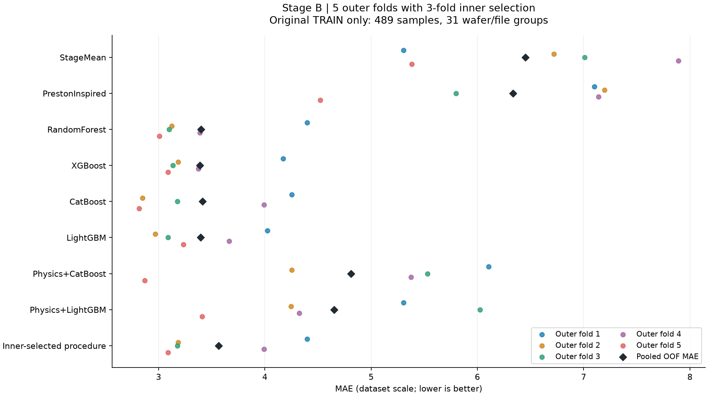

# Stage B 중첩 그룹 교차검증

**학습 데이터 내부 추가 검증 완료:** 기존 Stage B Train 489개 표본, 31개 그룹만 사용했습니다. v1 Validation·Calibration·Test와 Stage A는 학습·설정 선택·점수 계산에서 제외했습니다.

이 실험은 v1 결과를 이미 확인한 뒤 수행한 **개발 데이터 안정성 진단**입니다. 새 독립 테스트, 기존 테스트 성능의 개선 증명, 배포 승인으로 해석하지 않습니다. 기존 v1 모델과 평가 파일은 바꾸지 않았습니다.

## 내부 선택 절차의 성능

바깥 구간마다 안쪽 교차검증으로 모델·설정을 선택한 절차의 전체 OOF MAE는 **3.5636**, RMSE는 **4.4774**, R²는 **0.7182**입니다. 같은 바깥 구간의 평균 기준선 MAE 6.4525 대비 44.8% 낮습니다.

InnerSelected는 단일 모델 이름이 아닙니다. 각 바깥 구간에서 내부 검증만으로 선택한 모델의 예측을 합친 결과입니다. 아래 모델별 바깥 점수의 최솟값으로 모델을 다시 선정하지 않았습니다.

| 구간 | 평가 표본 | 평가 그룹 | 내부 검증 선정 | 내부 MAE | 바깥 MAE | 바깥 RMSE | 바깥 R² |
| --- | --- | --- | --- | --- | --- | --- | --- |
| 1 | 97 | 6 | RandomForest | 3.1409 | 4.3966 | 5.4312 | 0.4544 |
| 2 | 97 | 8 | XGBoost | 3.5377 | 3.1846 | 3.8454 | 0.8002 |
| 3 | 97 | 8 | CatBoost | 3.6124 | 3.1774 | 4.0069 | 0.7470 |
| 4 | 97 | 7 | CatBoost | 3.3933 | 3.9911 | 4.9773 | 0.7642 |
| 5 | 101 | 2 | XGBoost | 3.3124 | 3.0880 | 3.9134 | 0.6249 |

내부 검증의 모델 선택 빈도는 **XGBoost 2회, CatBoost 2회, RandomForest 1회**입니다. 선택 모델이 구간에 따라 바뀌는 정도를 성능 수치와 함께 해석해야 합니다. 바깥 학습 구간끼리는 데이터가 겹치므로 다섯 점수를 서로 독립인 반복 실험으로 취급하지 않습니다.

단독 ML 4종의 전체 MAE는 3.3887–3.4123, 결합 모델 2종은 4.6515–4.8101였습니다. 이 비교는 선언한 설정 범위와 현재 개발 데이터에 한정되며, 물리 결합 방법 전체의 성능을 일반화하지 않습니다.

## 8개 모델군 비교

| 모델 | 전체 MAE | RMSE | R² | 그룹 평균 MAE | 구간 최소 MAE | 구간 최대 MAE |
| --- | --- | --- | --- | --- | --- | --- |
| CatBoost | 3.4123 | 4.3167 | 0.7381 | 3.6415 | 2.8160 | 4.2538 |
| LightGBM | 3.3942 | 4.2544 | 0.7456 | 3.1674 | 2.9695 | 4.0228 |
| Physics+CatBoost | 4.8101 | 6.0573 | 0.4843 | 5.6383 | 2.8692 | 6.1056 |
| Physics+LightGBM | 4.6515 | 5.9658 | 0.4997 | 5.5988 | 3.4111 | 6.0230 |
| PrestonInspired | 6.3365 | 7.6526 | 0.1768 | 6.5727 | 4.5200 | 7.1964 |
| RandomForest | 3.4005 | 4.3609 | 0.7327 | 3.5438 | 3.0087 | 4.3966 |
| StageMean | 6.4525 | 8.5612 | -0.0303 | 10.5386 | 5.3030 | 7.8928 |
| XGBoost | 3.3887 | 4.2505 | 0.7460 | 3.4326 | 3.0880 | 4.1724 |
| InnerSelected | 3.5636 | 4.4774 | 0.7182 | 3.8037 | 3.0880 | 4.3966 |

전체 MAE는 모든 표본에 같은 가중치를 줍니다. 그룹 평균 MAE는 그룹마다 MAE를 계산한 뒤 31개 그룹을 같은 가중치로 평균합니다. 구간 최소·최대는 실제 다섯 평가 구간의 범위이며 신뢰구간이 아닙니다. 그룹 크기가 다르고 표본 1개인 그룹도 있어 두 집계 방식이 다를 수 있습니다.



## 결합 모델과 단독 모델의 차이

| 비교 | 전체 MAE 차이 | 그룹 평균 MAE 차이 | 결합 우세 그룹 | 단독 우세 그룹 | 동률 그룹 |
| --- | --- | --- | --- | --- | --- |
| Physics+CatBoost − CatBoost | 1.3978 | 1.9968 | 4 | 27 | 0 |
| Physics+LightGBM − LightGBM | 1.2574 | 2.4314 | 5 | 26 | 0 |

차이는 결합 모델 오차에서 단독 모델 오차를 뺀 값입니다. 음수이면 결합 모델의 오차가 더 작습니다. 그룹 승패는 기술 통계이며 독립 반복 실험이나 통계적 유의성 검정 결과가 아닙니다.

## 평가 설계

- 바깥 GroupKFold 5개, 각 바깥 학습 구간 안쪽 GroupKFold 3개입니다. 그룹 배치는 표본 수와 그룹 ID만 사용하며 제거율을 보지 않습니다.
- 같은 웨이퍼·원본 파일을 연결한 기존 그룹을 유지합니다. 모든 바깥·안쪽·잔차 교차검증에서 웨이퍼·파일·그룹 중복을 검사했습니다.
- 안쪽 예측 표본을 합친 MAE, RMSE, 고정 후보 ID 순서로 설정을 선택합니다. 각 모델군의 설정과 전체 선택을 파일로 고정한 뒤 바깥 구간을 평가합니다.
- 전처리 스키마·결측 대체·특징 필터와 물리 지수의 정규화는 해당 학습 구간에서만 적합합니다.
- RandomForest·XGBoost·CatBoost·LightGBM과 결합 모델의 부스팅 탐색 범위는 v1에 선언된 범위를 사용합니다. v1에서 고른 설정을 재사용하지 않습니다.
- PrestonInspired와 결합 모델의 물리 정규화 계수는 1.0으로 고정했습니다. 결합 모델 잔차는 해당 학습 구간 안에서 다시 3개 그룹 구간으로 나눈 OOF 물리 예측으로 계산합니다. v1의 물리 설정 선택 및 5개 잔차 구간과 다릅니다.
- GlobalMean·Ridge·PLS·KNN·SVR는 이번 안정성 진단 범위에서 제외했습니다. 기존 13종 모델 비교 결과는 v1 보고서에 남아 있습니다.
- Calibration을 재사용하거나 예측구간을 새로 보정하지 않았습니다. 저장된 5개 모델은 바깥 구간별 진단 체크포인트이며 전체 Train 재학습 배포 모델이 아닙니다.

## 검증 및 재현

안쪽 후보 적합 375회, 바깥 모델군 적합 40회를 수행했습니다. 별도 잔차용 물리 모델 적합은 이 횟수에서 제외합니다. 실행 시간은 1112.7초입니다.

모든 모델군이 489개 표본을 한 번씩 OOF 평가했고, 선택 체크포인트 5개의 저장 후 예측 재현 오차는 모두 1e-10 이하입니다. 시작 전후 원본 v1 아티팩트 전체 해시가 일치합니다. 분할·모델 선택·예측·결과의 해시와 그룹 경계는 저장소 테스트로 재검사합니다.

```bash
python -m cmp_ml.cli stability --source-run runs/phm_cmp_v1 --output-dir runs/my_stage_b_stability --threads 4
python -m cmp_ml.stability_report --run-dir runs/my_stage_b_stability
```

실행에는 로컬의 v1 features.csv.gz가 필요합니다. 전체 특징표와 원본 시계열은 Git에 포함하지 않습니다. 완료된 출력 디렉터리는 덮어쓰지 않습니다. 재실행으로 같은 개발 데이터가 독립 평가 데이터가 되지는 않습니다.

후속 단계에서 모델을 배포 후보로 정하려면 이 개발 진단과 분리된 새 데이터 평가 및 서비스 입력 검증이 필요합니다. WM-811K·MixedWM38 결함 분류와 Unity 서비스 연결은 이번 실험에 포함되지 않습니다.
