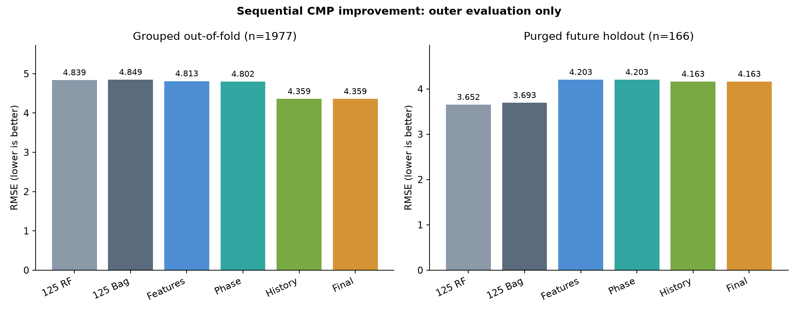

# CMP 특징·연마 구간·이력 순차 개선 v4

요청한 순서대로 125/73/12(+이력 연결 대조군 33) 특징 비교, 연마 구간 비교, 과거 이력 개선, 조건별 평균/직전값 대체까지 학습·평가했습니다. **그룹·시간순에서 두 125특징 대조군을 모두 이기는 채택 기준은 충족하지 못했습니다.** 일부 대응 그룹 재표집 구간이 0을 포함하거나 음수여서, 안정적인 우월성은 확인되지 않았습니다. 기존 robust v2보다 그룹·시간순 RMSE가 모두 좋아진 것은 아니므로, 기존 모델을 대체할 근거는 충분하지 않습니다. 기존 논문 baseline과 API/Unity 모델은 보존했습니다.

이 보고서의 감소율은 **RMSE의 상대 감소율**입니다. MSE와 백분율 오차를 혼용하지 않습니다. 공식 Test는 이미 여러 차례 확인한 참고 자료이며, 이번 결과는 새 독립 검증이 아닙니다.

## 동일 조건의 결과

모든 새 대조군은 완료된 과거 Train 이력만 사용합니다. RF/Bagging 설정과 각 외부 평가의 표본은 동일합니다. 125/73은 원래 논문 모델의 모든 절차를 재현한 결과가 아니라 새로 고정한 단순 트리 대조군입니다. compact12에는 이력이 없고 compact33에는 동일한 21개 이력이 있습니다.

| model | group_oof | temporal | validation | test |
| --- | --- | --- | --- | --- |
| full125_rf | 4.8390 | 3.6517 | 3.0423 | 3.0357 |
| full125_bag | 4.8487 | 3.6932 | 3.0702 | 3.0470 |
| primary73_rf | 4.8444 | 3.5766 | 2.9912 | 3.0143 |
| primary73_bag | 4.8398 | 3.6762 | 3.0217 | 3.0304 |
| compact12_rf | 4.7258 | 4.0935 | 3.7227 | 3.8223 |
| compact12_bag | 4.8359 | 4.1435 | 3.6959 | 3.8553 |
| compact33_rf | 5.5674 | 3.9046 | 3.1230 | 3.1080 |
| compact33_bag | 5.6006 | 3.9009 | 3.1325 | 3.1214 |
| S1_features | 4.8133 | 4.2030 | 3.4008 | 3.3913 |
| S2_phase | 4.8023 | 4.2030 | 3.3970 | 3.3801 |
| S3_history | 4.3594 | 4.1632 | 3.4334 | 3.5088 |
| S4_final | 4.3594 | 4.1632 | 3.4334 | 3.5088 |
| condition_mean | 7.8586 | 7.4579 | 7.7172 | 7.1810 |
| persistent | 7.7452 | 6.2496 | 3.9827 | 3.9876 |

S1~S4는 평가 데이터를 보고 고른 최솟값이 아닙니다. 각 바깥 학습 부분에서 내부 그룹/시간 평가로 순차 선택한 **절차**의 바깥 예측 결과입니다. 각 단계는 이전 설정을 후보에 유지하지만, 내부 점수가 좋아져도 바깥 점수는 나빠질 수 있습니다.

## 단계별 추가 효과

첫 행의 이전 기준은 full125_bag이며, 그다음은 바로 앞 단계입니다. 음수는 악화입니다. 그룹 평가에서 가장 큰 추가 감소는 이력 선택 단계에서 나타났지만, 시간순에서 특징 선택 단계의 악화를 만회하지 못했습니다. 시간순 표준 B에서 내부 검증으로 선택된 12변수 RF의 RMSE는 5.2060으로, 고정 125특징 RF의 4.0190보다 높았습니다.

| evaluation | stage | rmse | mse | rmse_improvement_vs_previous_pct |
| --- | --- | --- | --- | --- |
| group_oof | S1_features | 4.8133 | 23.1681 | 0.7305 |
| group_oof | S2_phase | 4.8023 | 23.0626 | 0.2280 |
| group_oof | S3_history | 4.3594 | 19.0045 | 9.2233 |
| group_oof | S4_final | 4.3594 | 19.0045 | 0.0000 |
| temporal | S1_features | 4.2030 | 17.6652 | -13.8052 |
| temporal | S2_phase | 4.2030 | 17.6652 | 0.0000 |
| temporal | S3_history | 4.1632 | 17.3325 | 0.9461 |
| temporal | S4_final | 4.1632 | 17.3325 | 0.0000 |

## 최종 모델 개선 폭과 불확실성

| evaluation | baseline | baseline_rmse | candidate_rmse | rmse_improvement_pct | bootstrap_low_pct | bootstrap_high_pct | groups |
| --- | --- | --- | --- | --- | --- | --- | --- |
| group_oof | full125_rf | 4.8390 | 4.3594 | 9.9100 | 5.9745 | 13.1807 | 54 |
| group_oof | full125_bag | 4.8487 | 4.3594 | 10.0918 | 4.8840 | 13.6288 | 54 |
| temporal | full125_rf | 3.6517 | 4.1632 | -14.0066 | -30.7428 | 8.6817 | 11 |
| temporal | full125_bag | 3.6932 | 4.1632 | -12.7285 | -28.7823 | 9.7198 | 11 |

구간은 2,000회 대응 연결 그룹 재표집의 2.5~97.5 백분위입니다. 시간순 평가는 같은 11개 연결 그룹만 포함하므로 시간 의존성과 작은 그룹 수에 대한 한계가 있습니다. 모델 재학습/선택의 불확실성이나 다중 비교 보정까지 반영한 확증 구간이 아닙니다.

## 기존 완료 이력 모델과 비교

같은 표본·바깥 분할의 robust v2 `completed/selected`와 비교했습니다. 모델 종류, 입력, 내부 선택 방식 등이 함께 달라 단일 수정의 효과로 해석할 수 없습니다. 기존 논문 비교용 retrospective 통합 모델 Test MSE 7.0743과 이 수치를 섞어 순위를 매기지 않습니다.

| evaluation | robust_v2_rmse | staged_v4_rmse | rmse_improvement_pct | robust_v2_mse | staged_v4_mse |
| --- | --- | --- | --- | --- | --- |
| group_oof | 4.6658 | 4.3594 | 6.5660 | 21.7694 | 19.0045 |
| temporal | 3.4309 | 4.1632 | -21.3435 | 11.7714 | 17.3325 |
| validation | 2.9224 | 3.4334 | -17.4865 | 8.5402 | 11.7881 |
| test | 2.9915 | 3.5088 | -17.2909 | 8.9491 | 12.3114 |

## 조건별 그룹·시간순 결과

| evaluation | model | condition | n | rmse | mae | p95_abs_error |
| --- | --- | --- | --- | --- | --- | --- |
| group_oof | S4_final | Cond1 | 798 | 4.3428 | 3.3601 | 8.8622 |
| group_oof | S4_final | Cond2 | 815 | 4.6063 | 3.6161 | 9.1171 |
| group_oof | S4_final | Cond3 | 364 | 3.7904 | 2.9475 | 7.7843 |
| group_oof | full125_bag | Cond1 | 798 | 4.7761 | 3.6763 | 10.2731 |
| group_oof | full125_bag | Cond2 | 815 | 5.3858 | 4.3778 | 10.6145 |
| group_oof | full125_bag | Cond3 | 364 | 3.5688 | 2.7304 | 7.1453 |
| group_oof | full125_rf | Cond1 | 798 | 4.8284 | 3.7290 | 10.1858 |
| group_oof | full125_rf | Cond2 | 815 | 5.3210 | 4.3290 | 10.4654 |
| group_oof | full125_rf | Cond3 | 364 | 3.5600 | 2.7095 | 7.2854 |
| temporal | S4_final | Cond1 | 74 | 2.5143 | 1.9492 | 4.8926 |
| temporal | S4_final | Cond2 | 67 | 5.2060 | 4.1160 | 9.2870 |
| temporal | S4_final | Cond3 | 25 | 4.8725 | 3.9265 | 10.1179 |
| temporal | full125_bag | Cond1 | 74 | 2.5600 | 1.9910 | 5.0746 |
| temporal | full125_bag | Cond2 | 67 | 4.1775 | 3.1970 | 8.6038 |
| temporal | full125_bag | Cond3 | 25 | 4.9394 | 3.9871 | 10.5081 |
| temporal | full125_rf | Cond1 | 74 | 2.5932 | 2.0243 | 4.8479 |
| temporal | full125_rf | Cond2 | 67 | 4.0190 | 3.1256 | 8.2676 |
| temporal | full125_rf | Cond3 | 25 | 5.0352 | 4.0826 | 10.5492 |

최종 전체 Train 적합에서 고른 설정은 다음과 같습니다. 각 외부 fold는 자신의 Train만으로 따로 선택했으며 전체 Train 설정으로 외부 fold를 재평가하지 않았습니다.

| condition | stage | features | phase | history | family | inputs |
| --- | --- | --- | --- | --- | --- | --- |
| Cond1 | S1_features | compact12 | raw | none | rf | 12 |
| Cond1 | S2_phase | compact12 | gap | none | rf | 12 |
| Cond1 | S3_history | compact12 | gap | none | rf | 12 |
| Cond1 | S4_final | compact12 | gap | none | rf | 12 |
| Cond2 | S1_features | primary73 | raw | raw | rf | 73 |
| Cond2 | S2_phase | primary73 | gap | raw | rf | 73 |
| Cond2 | S3_history | primary73 | gap | none | rf | 52 |
| Cond2 | S4_final | primary73 | gap | none | rf | 52 |
| Cond3 | S1_features | full125 | raw | raw | rf | 125 |
| Cond3 | S2_phase | full125 | longest | raw | rf | 125 |
| Cond3 | S3_history | full125 | longest | standardized | rf | 125 |
| Cond3 | S4_final | full125 | longest | standardized | rf | 125 |

## 12변수 정의와 묶음 제거 검사

12개 입력 = 소모품 3종 평균 + 압력 4종 평균 + wafer/head 회전 평균 + slurry C 평균 + 연마 시간 + 고유 timestamp 수입니다. Claude 자료에는 core 7의 정확한 공식과 실행 코드가 없으므로, 이를 **명시적으로 정의한 검증용 후보**로 구현했습니다. count를 stage rotation 평균으로 바꾼 대안도 평가했습니다. 아래 진단은 primary 활성 구간을 쓰며 최종 선택 후보에는 포함하지 않았습니다.

| model | group_oof | temporal | validation | test |
| --- | --- | --- | --- | --- |
| ablation_compact12_bag | 7.4193 | 10.0340 | 3.8458 | 3.9733 |
| ablation_compact12_rf | 7.2100 | 9.8337 | 4.1033 | 4.3540 |
| ablation_compact_no_pressure_bag | 7.4134 | 8.9809 | 3.8190 | 3.8537 |
| ablation_compact_no_pressure_rf | 7.2621 | 9.2729 | 4.1472 | 4.3071 |
| ablation_compact_no_slurry_bag | 7.4313 | 9.9720 | 3.8277 | 3.8888 |
| ablation_compact_no_slurry_rf | 7.2636 | 9.6613 | 4.1330 | 4.3815 |
| ablation_compact_no_usage_bag | 8.2260 | 7.6082 | 7.3789 | 6.8441 |
| ablation_compact_no_usage_rf | 8.1620 | 7.5816 | 7.3422 | 6.8008 |
| ablation_compact_stage12_bag | 7.4170 | 10.0346 | 3.8460 | 3.9715 |
| ablation_compact_stage12_rf | 7.2568 | 9.8033 | 4.0953 | 4.3464 |

진단 값은 삭제하면 항상 좋아진다는 주장이나 센서의 물리적 인과 효과를 입증하지 않습니다. 모든 비교에서 같은 조건의 평균 모델을 함께 평가했습니다. 고속 Cond3의 ML 사용을 사전에 금지하지 않았습니다.

## 극단값 포함 민감도

full1981은 네 극단값을 포함해 재학습하고 해당 fold에 배정된 모든 표본을 평가합니다. full_fit_clean_eval은 같은 재학습 모델을 원래 clean 평가 표본에서만 평가합니다. 선택 설정은 clean Train 내부에서 미리 정한 그대로입니다.

| cohort_variant | evaluation | model | n | mse | rmse |
| --- | --- | --- | --- | --- | --- |
| full1981 | group_oof | S4_final | 1981 | 36446.6141 | 190.9100 |
| full1981 | group_oof | full125_bag | 1981 | 36506.1478 | 191.0658 |
| full1981 | temporal | S4_final | 166 | 78.8944 | 8.8823 |
| full1981 | temporal | full125_bag | 166 | 76.2890 | 8.7344 |
| full1981 | test | S4_final | 424 | 1461.8382 | 38.2340 |
| full1981 | test | full125_bag | 424 | 2980.0806 | 54.5901 |
| full1981 | validation | S4_final | 424 | 3626.5799 | 60.2211 |
| full1981 | validation | full125_bag | 424 | 4283.7229 | 65.4502 |
| full_fit_clean_eval | group_oof | S4_final | 1977 | 3232.4822 | 56.8549 |
| full_fit_clean_eval | group_oof | full125_bag | 1977 | 3255.8458 | 57.0600 |
| full_fit_clean_eval | temporal | S4_final | 166 | 78.8944 | 8.8823 |
| full_fit_clean_eval | temporal | full125_bag | 166 | 76.2890 | 8.7344 |
| full_fit_clean_eval | test | S4_final | 424 | 1461.8382 | 38.2340 |
| full_fit_clean_eval | test | full125_bag | 424 | 2980.0806 | 54.5901 |
| full_fit_clean_eval | validation | S4_final | 424 | 3626.5799 | 60.2211 |
| full_fit_clean_eval | validation | full125_bag | 424 | 4283.7229 | 65.4502 |

네 극단값을 계측 오류로 확정하지 않았습니다. 제외 정책을 바꾸면 대상 문제 자체가 달라질 수 있으므로 두 집단의 최저 점수를 섞어 선택하지 않습니다.

## 검증·산출물

- 21개 바깥/전체 적합 작업, 각 작업에서 3개 내부 그룹 fold와 1개 purged 시간 holdout. 내부 후보 평가 2336건, 트리 모델 내부 적합 2168건.
- 최종/바깥 트리는 3개 고정 seed 예측을 평균. 전체 지표에 seed별 RMSE 범위와 MAE·상위 5% 오차 경계를 기록했습니다.
- 보고서 수정 후 전체 테스트 156개 통과(기존 경고 4개). 신규 검사는 미래/동일 웨이퍼 이력 차단, 정확한 12/33개 입력 수, reset 시 이력 차단, 구간 공백·빈 구간 처리, 센서 특징의 정답 독립성, 참고 자료의 그룹 정보 누락 처리를 확인합니다. [테스트 기록](test_results.json).
- 참고용 Validation/Test에는 연결 그룹 식별자가 없어 대응 그룹 신뢰구간을 산출하지 않습니다. 최초 평가의 빈 그룹 집계에서 발생한 NaN 표시를 [보고서 전용 수정 기록](amendments/01_reference_intervals.json)으로 보완했습니다. 기존 코드·비교표·완료 기록을 보존했고 모델, 선택, 예측, MSE/RMSE/MAE 값은 변경하지 않았습니다. 이 경우의 회귀 검사를 추가한 신규 테스트 8개도 통과했습니다.
- 원본 555개 센서 파일 SHA-256 확인. 센서 통계에는 정답을 사용하지 않았습니다. 깨끗한 Train 중 활성 구간 없는 표본 수: {'Cond1': 27, 'Cond2': 28, 'Cond3': 250}. 이 표본들은 삭제하지 않고 결측을 학습 fold 안에서 처리했습니다.
- 각 후보의 모든 이력 참조는 다른 웨이퍼·동일 조건·동일 장비이며 원래 trace 종료 시점이 query 시작보다 이른 Train 표본만 사용합니다. 라벨 계측 지연은 없어 즉시 이용 가능하다고 가정했습니다.
- 모든 선택·모델·참고용 예측을 봉인한 뒤 이번 실행의 Test 정답을 읽었습니다. 총 예측 110,679행, 재로딩 최대 차이 0, 이전 산출물 1,348개 해시 유지.
- 연마 후 전체 trace를 사용하는 가상 계측 모델입니다. 실제 공정 전에 슬라이더를 바꿔 결과를 예측하는 인과 시뮬레이터로 검증된 것은 아닙니다.

[고정 계획](PROTOCOL.md) · [전체 지표](metrics.csv) · [fold별 지표](fold_metrics.csv) · [대응 비교](paired_comparisons.csv) · [모델 파일·해시](training_complete.json) · [분할 검사](partition_audit.json) · [재검증](verification.json)

실행: `python -m cmp_ml.staged_experiment prepare`, `train`, `evaluate` 순서. 완료된 디렉터리는 덮어쓰지 않습니다. 최종 재검증은 `python tools/verify_staged.py`, 보고서 생성은 `python tools/report_staged.py`입니다. 원본 데이터는 저장소에 포함하지 않습니다.
