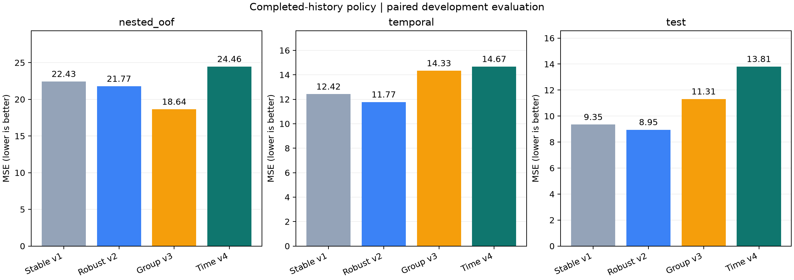

# P2 시간순 내부 선택 실험 v4

**그룹·시간순·기존 Test 모두 기존 robust v2보다 MSE가 높아졌다. 추가 오차 감소에 성공하지 못했으며 기존 모델을 유지한다.** API/Unity 모델은 교체하지 않았다. 계획한 21개 학습·선택과 저장 모델 검증을 완료했다.
논문 baseline의 성능과 이 제안 모델 연구는 [최종 비교 보고서](../phm_cmp_final_comparison/README.md)에서 구분한다.

완료된 과거 공정 이력 조건에서 robust v2 → 시간순 선택 v4의 MSE는 그룹 검증
**21.7694 → 24.4634**, 시간순 **11.7714 → 14.6734**,
기존 공식 Test **8.9491 → 13.8081**다. Test는 이미 확인한 424건을 재사용했으며 새 독립 검증이 아니다.

## 비교 결과

| evaluation | reference | reference_mse | selected_mse | mse_reduction_percent |
|---|---|---|---|---|
| nested_oof | robust_reference | 21.7694 | 24.4634 | -12.3749 |
| nested_oof | group_selected_v3 | 18.6431 | 24.4634 | -31.2197 |
| nested_oof | previous_control | 22.4289 | 24.4634 | -9.0710 |
| temporal | robust_reference | 11.7714 | 14.6734 | -24.6532 |
| temporal | group_selected_v3 | 14.3296 | 14.6734 | -2.3996 |
| temporal | previous_control | 12.4201 | 14.6734 | -18.1431 |
| test | robust_reference | 8.9491 | 13.8081 | -54.2959 |
| test | group_selected_v3 | 11.3107 | 13.8081 | -22.0798 |
| test | previous_control | 9.3458 | 13.8081 | -47.7462 |
| validation | robust_reference | 8.5402 | 12.5853 | -47.3650 |
| validation | group_selected_v3 | 8.9916 | 12.5853 | -39.9676 |
| validation | previous_control | 8.9955 | 12.5853 | -39.9057 |

MSE 감소율은 오차 제곱 평균의 상대 변화이며 정확도나 MAPE가 아니다. 양수는 개선, 음수는 악화다.
그룹 재표집 구간은 고정 예측에 대한 기술적 불확실성 요약이며 확인적 검정이 아니다.

| model | nested_oof | temporal | validation | test |
|---|---|---|---|---|
| base_direct | 17.7196 | 13.2797 | 12.6967 | 14.6868 |
| base_residual | 27.8967 | 14.6734 | 14.1075 | 16.0940 |
| group_selected_v3 | 18.6431 | 14.3296 | 8.9916 | 11.3107 |
| history_anchor | 67.4161 | 24.4379 | 16.6295 | 17.9339 |
| joint_direct | 20.1383 | 10.2151 | 11.9612 | 13.6727 |
| joint_residual | 31.9139 | 18.5449 | 14.7525 | 16.1030 |
| previous_control | 22.4289 | 12.4201 | 8.9955 | 9.3458 |
| robust_reference | 21.7694 | 11.7714 | 8.5402 | 8.9491 |
| selected | 24.4634 | 14.6734 | 12.5853 | 13.8081 |

`robust_reference`는 같은 부모 학습 분할의 기존 robust v2 절차, `group_selected_v3`는 이전 그룹 내부 검증 선택,
`selected`는 이번 시간순 내부 검증 선택이다. 후보별 바깥 결과를 보고 `selected`를 바꾸지 않았다.
`history_anchor`는 진단용 기준값이며 선택 후보가 아니다.

## 사전에 고정한 선택 절차

- 각 조건의 시작 시각 40/60/80% 지점을 이용해 이전 공정 → 이후 공정의 검증 창을 만들었다.
- 웨이퍼/파일 연결 그룹 전체를 보존하고, 경계를 걸치는 그룹을 해당 창에서 제외했다.
  학습 그룹 종료 시각은 검증 그룹 시작 시각보다 엄격히 이르다.
- 학습 60건·6그룹 이상, 검증 10건·2그룹 이상인 창만 사용했다. 조건별 유효 창이 2개 미만이면 실패하도록 고정했다.
- 각 창의 앞선 학습 자료만으로 기존 robust 절차와 CatBoost 후보를 다시 적합했다.
  기존 robust 절차 안의 그룹 검증은 유지하고, 최상위 모델 선택을 시간순으로 바꿨다.
- 네 후보 각각의 설정을 유효 검증 표본 전체의 MSE로 고른 뒤 기존 robust 후보와 비교했다.
  작은 창과 큰 창의 평균을 같은 비중으로 합치지 않았다.
- 21개 부모 학습의 유효 창 59개,
  표본 부족으로 제외한 창 4개를 전부 기록했다.
  [분할별 크기](rolling_coverage.csv), [표본 ID와 경계](rolling_plan.json).

최종 전체 Train 적합에 적용한 선택:

| condition | selected | inner_mse | selection_n |
|---|---|---|---|
| Cond1 | base_direct | 23.9266 | 284 |
| Cond2 | joint_direct | 56.1103 | 336 |
| Cond3 | base_residual | 14.2427 | 108 |

시간순 내부 선택 표본은 부모 Train의 일부다. 전체 그룹 OOF의 난도나 시간 범위를 대표한다고 가정하지 않는다.
직접 예측과 잔차 예측, 125/401개 특징, 네 후보 × 4개 CatBoost 설정(총 16조합), 이력 교차 적합, 예측 범위 제한은 v3와 같다.
Train의 자기 파일/웨이퍼 그룹 정답을 제외한 이력 특징을 쓰며 조회에는 적합 집합의 완료된 이력만 쓴다.
과거 공정 종료 즉시 제거율을 알 수 있다는 가정은 남아 있다.

## 검증 증거

- 저장 예측으로 지표 216행의 8개 값을 독립 재계산했다.
- 선택 21개·시간순 창 59개·학습 특징 교차 적합 240개를 확인했다.
- 모델 재로딩·조회 순서 변경·조회 정답 변조 불변성을 24개 블록에서 확인했다.
- 기존 파일 741개 해시를 보존했다. 원래 robust 예측도 동일하게 재현했다.
- [선택 기록](selection.json), [모델 파일](training_complete.json), [전체 지표](metrics.csv),
  [독립 검증](independent_verification.json), [테스트](tests.json), [산출물 해시](artifact_manifest.json).
- [실행 방법과 고정 계획](../../docs/p2-temporal-v4.md). 원시 자료와 전체 중간 모델 캐시는 Git에 넣지 않는다.

| evaluation | model | n | clipped_n | clipped_fraction |
|---|---|---|---|---|
| nested_oof | selected | 1977 | 4 | 0.0020 |
| temporal | selected | 166 | 0 | 0.0000 |
| test | selected | 424 | 0 | 0.0000 |
| validation | selected | 424 | 0 | 0.0000 |

위 범위 제한은 학습 정답의 min/max를 사용하며 평가 정답으로 정하지 않았다. 기존 모델의 Bagging 대체는 별도 규칙이다.

