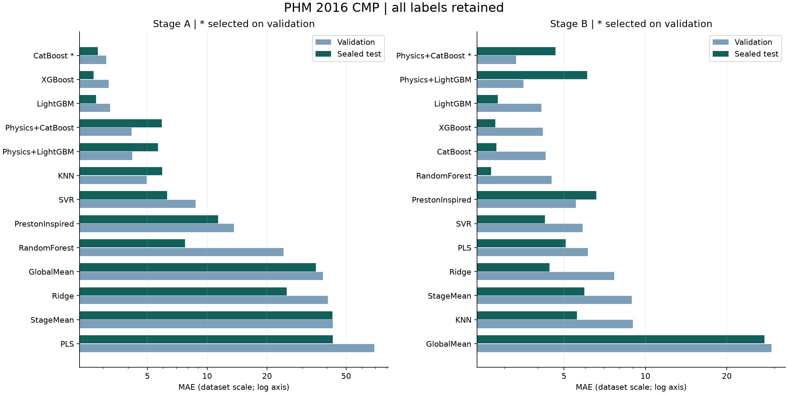
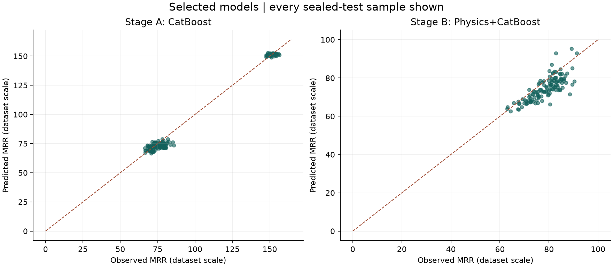

# PHM 2016 CMP experiment v1

This is an offline regression benchmark, not a production release or a causal CMP simulator.

## Validation-selected models

| stage | selected_model | test_n | test_mae | stage_mean_mae | mae_improvement_percent | test_rmse | test_r2 | interval_coverage | mean_interval_width |
| --- | --- | --- | --- | --- | --- | --- | --- | --- | --- |
| A | CatBoost | 174 | 2.8164 | 42.6758 | 93.4004 | 3.6262 | 0.9888 | 0.9655 | 16.0949 |
| B | Physics+CatBoost | 122 | 4.6455 | 5.9480 | 21.8978 | 5.6180 | 0.1774 | 0.9098 | 17.8465 |

The selected model for each stage was frozen before opening Test. Test rankings must not be used to retune this run.

Interpretation: the four extreme-label wafers all landed in Train. Test therefore does not evaluate extreme-MRR generalization, and the Stage A mean baseline is strongly influenced by those Train labels. Stage A's gain over this mean must not be interpreted as a gain over a robust route-aware baseline, which was not included in this experiment. Stage B's validation winner underperformed several standalone ML models on Test; retain the frozen choice as an honest selection outcome rather than claiming the hybrid is universally best.

## Data integrity and split

- 185 source CSVs; 672,744 raw rows; 1,981 wafer-stage targets.
- Empty files: CMP-training-066.csv.
- Exact duplicate measurements removed in the derived dataset: 1,819; source files are unchanged.
- 25 wafer-stage traces span files. Machine identity and nonoverlapping time ranges were checked before merging.
- 1 cross-file gap exceeds 60.0 source timestamp units; AUC and observed duration do not bridge long gaps.
- 1699 wafers in 54 connected components. Wafer, file, and component overlap across splits is zero.
- Split candidates use sample counts and Stage labels only, not target values. This is a grouped random holdout, not a chronological future-production test.

| split | A | B | total | fraction | groups |
| --- | --- | --- | --- | --- | --- |
| train | 692 | 489 | 1181 | 0.5962 | 43 |
| validation | 175 | 122 | 297 | 0.1499 | 4 |
| calibration | 125 | 82 | 207 | 0.1045 | 2 |
| test | 174 | 122 | 296 | 0.1494 | 5 |

## Full model comparison

| stage | model | validation_mae | mae | rmse | r2 | negative_predictions | coverage |
| --- | --- | --- | --- | --- | --- | --- | --- |
| A | CatBoost | 3.1112 | 2.8164 | 3.6262 | 0.9888 | 0 | 0.9655 |
| A | XGBoost | 3.2037 | 2.6858 | 3.4144 | 0.9901 | 0 | 1.0000 |
| A | LightGBM | 3.2544 | 2.7568 | 3.5268 | 0.9894 | 0 | 0.9655 |
| A | Physics+CatBoost | 4.1624 | 5.9198 | 7.1004 | 0.9572 | 0 | 0.8908 |
| A | Physics+LightGBM | 4.1962 | 5.6635 | 6.8102 | 0.9606 | 0 | 0.8966 |
| A | KNN | 4.9720 | 5.9297 | 27.9895 | 0.3350 | 0 | 0.9885 |
| A | SVR | 8.7311 | 6.2922 | 8.4267 | 0.9397 | 0 | 0.9943 |
| A | PrestonInspired | 13.6567 | 11.3463 | 22.5924 | 0.5667 | 0 | 0.9310 |
| A | RandomForest | 24.2109 | 7.7450 | 34.4848 | -0.0095 | 0 | 0.9540 |
| A | GlobalMean | 38.2599 | 35.2159 | 35.9525 | -0.0973 | 0 | 0.9655 |
| A | Ridge | 40.4945 | 25.1241 | 54.4566 | -1.5174 | 3 | 0.9885 |
| A | StageMean | 42.8030 | 42.6758 | 43.6259 | -0.6157 | 0 | 1.0000 |
| A | PLS | 69.2230 | 42.8865 | 74.1272 | -3.6646 | 9 | 0.9943 |
| B | Physics+CatBoost | 3.3267 | 4.6455 | 5.6180 | 0.1774 | 0 | 0.9098 |
| B | Physics+LightGBM | 3.5434 | 6.0918 | 7.3035 | -0.3902 | 0 | 0.8197 |
| B | LightGBM | 4.1236 | 2.8435 | 3.5338 | 0.6745 | 0 | 0.9508 |
| B | XGBoost | 4.1766 | 2.7846 | 3.4721 | 0.6858 | 0 | 0.9098 |
| B | CatBoost | 4.2776 | 2.8088 | 3.5601 | 0.6697 | 0 | 0.9262 |
| B | RandomForest | 4.4981 | 2.6842 | 3.4931 | 0.6820 | 0 | 0.9508 |
| B | PrestonInspired | 5.5316 | 6.5754 | 8.0030 | -0.6692 | 0 | 0.6721 |
| B | SVR | 5.8602 | 4.2533 | 5.2669 | 0.2770 | 0 | 0.9754 |
| B | PLS | 6.1267 | 5.0651 | 6.3178 | -0.0402 | 0 | 0.9016 |
| B | Ridge | 7.6699 | 4.4247 | 5.4273 | 0.2323 | 0 | 0.9590 |
| B | StageMean | 8.8956 | 5.9480 | 7.7065 | -0.5478 | 0 | 0.9918 |
| B | KNN | 8.9737 | 5.5882 | 6.6137 | -0.1400 | 0 | 0.9508 |
| B | GlobalMean | 29.2977 | 27.5456 | 28.2335 | -19.7747 | 0 | 0.9918 |

## Outlier sensitivity (diagnostic only)

All four previously identified extreme-label wafers remain in the primary data and training. Their split assignment is shown below. The following sensitivity table excludes them ONLY from a separate diagnostic evaluation; it is not the headline score or a retraining result.

| WAFER_ID | STAGE | split | AVG_REMOVAL_RATE |
| --- | --- | --- | --- |
| 1834206730 | A | train | 4202.1124 |
| 1834206944 | A | train | 4182.4165 |
| 1834206972 | A | train | 4129.4940 |
| 2058207580 | A | train | 4326.1541 |

| stage | model | n | mae | rmse | r2 |
| --- | --- | --- | --- | --- | --- |
| A | CatBoost | 174 | 2.8164 | 3.6262 | 0.9888 |
| B | Physics+CatBoost | 122 | 4.6455 | 5.6180 | 0.1774 |

## Modeling and uncertainty

- Each Stage has independent fitted preprocessing and model artifacts. GlobalMean is the pooled TRAIN mean; StageMean is each Stage's TRAIN mean.
- Feature schema, medians, missing flags, constant filtering, scaling, and physics coefficients use TRAIN only. Absolute time, file identity, wafer ID, and target are not predictor columns.
- Sensor statistics include mean, population standard deviation, min/max, first/last, range, slope, gap-aware AUC, and zero ratio; chamber features retain route information.
- PrestonInspired is a regularized, robust log-target power-law proxy using normalized wafer-load pressure, motion, slurry, and usage indices. It is not a physical calibration, and its coefficients are not causal effects.
- Hybrid residual targets use out-of-fold physics predictions from disjoint TRAIN components, with the final physics model fitted on full TRAIN. This differs from fitting residuals on the physics model's in-sample predictions.
- Small, predeclared grids select each family on Validation MAE (RMSE tie-break). Search budgets differ by family; this is an initial benchmark, not an exhaustive optimization claim.
- Models are not refitted on Train+Validation. Calibration remains separate. No Test labels enter model selection.
- Prediction interval radius uses the per-stage calibration residual rank ceil((n+1)*0.9), only with at least 80 calibration samples. Correlated records within components invalidate iid sample exchangeability, so the intervals are empirical diagnostics without guaranteed 90% coverage.
- Calibration has only 1 independent file/wafer component(s) in Stage A and 2 in Stage B. Meeting the row-count minimum does not establish broad group coverage. Stage A selected-model empirical coverage is 96.55%, outside the specification's 85–95% interval QA band; it is not certified for release.
- Negative predictions are counted, not silently clamped in primary point metrics. This benchmark does not certify UI response, OOD handling, causal setpoint effects, or all v0.4.0 release gates.

## Reproduction

See the repository README for commands. The raw dataset and derived feature matrix are not redistributed. File hashes, row lineage via source filenames, fixed split manifest, grids, versions, fitted artifacts, and held-out predictions are retained.
Training wall time: 228.8 seconds. CPU threads: 4.

## Sources

- [PHM Society official challenge](https://phmsociety.org/conference/annual-conference-of-the-phm-society/annual-conference-of-the-prognostics-and-health-management-society-2016/phm-data-challenge-4/)
- [scikit-learn grouped cross-validation](https://scikit-learn.org/stable/modules/cross_validation.html#group-k-fold)
- [scikit-learn regression metrics](https://scikit-learn.org/stable/modules/model_evaluation.html)

## Verification

Saved-model reproduction passed for 26 artifacts. Split and OOF group integrity passed.

| stage | model | repetitions | max_difference | warm_p95_seconds |
| --- | --- | --- | --- | --- |
| A | CatBoost | 100 | 0.0000 | 0.0662 |
| B | Physics+CatBoost | 100 | 0.0000 | 0.0114 |
