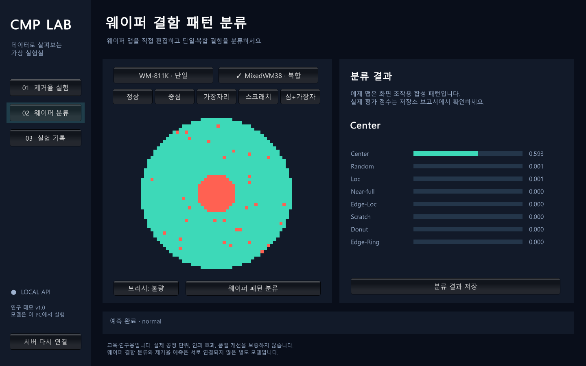

# 로컬 API·Unity 통합 검증

제거율 예측과 두 종류의 웨이퍼 분류를 로컬 HTTP API에 연결하고, CMP 전용 Unity 프로젝트와 Windows 실행 파일을 만들었습니다. 실제 Unity Player에서 모델 호출과 저장·조회까지 검증했습니다. 결과는 연구 데모이며 제조 환경 운영 승인을 뜻하지 않습니다.

## 구현 범위

- Stage A/B의 4개 실제 Train 기반 anchor 시나리오와 5개 관측 지수 입력
- Stage Mean, PrestonInspired, 기존 검증 선정 모델 비교와 anchor 대비 변화량
- 원본 25컬럼 시계열 입력에서 학습 때와 같은 특징 집계
- Train 변수 범위와 표준화 벡터 k=10 최근접 거리로 OOD 판단·차단
- WM-811K 9종 단일 분류, MixedWM38 8개 기본 결함 다중 라벨 분류
- 모델·데이터 형식 검사, artifact 해시 검증, 부분 실패·전체 실패 응답
- SQLite 예측·실험 저장, 재시작 후 멱등 처리, 중복 차단, cursor 목록, 상세·삭제·JSON/CSV 내보내기
- API의 20점 이하 민감도 계산과 2–5개 저장 실험 비교
- Unity의 Stage 전환 확인, 초기화, 입력 유지, 예제 웨이퍼 편집, 예측·저장·목록·JSON 내보내기

## 실행 검증

Unity **6000.3.21f1 / StandaloneWindows64** 빌드가 성공했습니다. 실행 파일의 해시·크기는 [unity_build.json](unity_build.json), 실제 Player의 검사 결과는 [smoke.json](smoke.json)에 있습니다. health, Stage A, Stage B, WM-811K, MixedWM38, 저장, 목록 조회가 모두 통과했습니다. 실제 표시 화면을 캡처하여 글자·값·결과 구성을 확인했습니다. 다른 게임 프로젝트는 수정하지 않았습니다.

Unity JsonUtility가 JSON null을 빈 객체로 만드는 동작을 실제 통합 검사에서 발견해, envelope status로 data/error를 명시적으로 구분했습니다. 최초 실패 기록과 숨긴 창의 검은 캡처를 최종 증거로 쓰지 않고 수정 후 표시된 창에서 다시 확인했습니다.

## 반복성·응답시간

CPU에서 각각 100회 실행했습니다. HTTP TestClient 처리와 로컬 SQLite 쓰기를 포함하며, 네트워크 지연·새 OS 설치 시간을 측정한 값은 아닙니다.

| 경로 | p95 | 최대 |
|---|---:|---:|
| MRR Stage A | 0.0656초 | 0.0808초 |
| MRR Stage B | 0.0676초 | 0.1539초 |
| WM-811K | 0.0190초 | 0.0213초 |
| MixedWM38 | 0.0195초 | 0.0360초 |

앱 구성·모델 preload는 2.6170초였습니다. 이는 Python 모듈 import 뒤의 생성 시간이며 전체 프로세스 시작이나 새 PC 설치 시간으로 주장하지 않습니다. 모델별 100회 반복 예측 차이는 **0**입니다. 원본 PHM 26개 모델 해시도 전부 일치합니다. [verification.json](verification.json), [latency.csv](latency.csv)를 참고하세요.

Train 원시 시계열 1개를 API 변환으로 다시 계산했을 때 저장된 특징표와 최대 절대차는 **2.33×10⁻¹⁰**이었습니다. API로 실제 원시 시계열 요청도 성공했습니다. 개인정보를 요구하지 않으며 원격 서비스로 데이터나 예측 로그를 전송하지 않습니다.

## 입력 반응과 구간 보정 확인

일반 anchor에서 변수별 p25/p75 교란을 검사했습니다. OOD가 아닌 입력 중 `max(1e-6, anchor 예측의 0.1%)` 이상 반응한 제어는 A **4/5**, B **3/5**였습니다. 일부 스테이지 회전 교란은 다변량 OOD로 차단됐고, 헤드 회전의 반응은 기준보다 작았습니다. 결과는 [input_reaction.csv](input_reaction.csv)에 있습니다. 이 변화 방향을 물리 법칙이나 인과 효과로 해석하지 않습니다.

시나리오 변화는 요약 특징에 적용한 가상 이동입니다. zero_ratio 등 일부 형태 특징은 anchor에 고정되므로 수정된 모든 원시 센서 행을 재현한 것으로 주장하지 않습니다. AUC는 긴 공백을 제외한 observed duration으로 이동합니다.

**PHM 예측구간은 기존 보정을 유지했습니다.** 기존 외부 평가에서 주 모델의 실측 coverage는 96.63–100%로 85–95% QA 기준을 벗어납니다. [기존 구간 증거](existing_interval_evidence.csv)에 확인 내용을 남겼습니다. 공개된 정답에 맞춰 구간을 줄이거나 새로운 보정 완료라고 주장하지 않습니다. 시나리오 변경 뒤 coverage는 검증되지 않았으며 UI에도 표시합니다. 분류 점수 또한 보정된 확률이 아닙니다.

## 완료 범위와 한계

학습 결과 연결, 입력 검증, 성능·반복성 검사, 로컬 저장 및 Unity 통합은 완료됐습니다. 첨부 명세의 Streamlit 중심 구조는 사용자가 요청한 HTTP API·Unity 구조로 변경했습니다. 릴리스 이름은 **research_demo**이며 예전 Test를 재선정에 이용해 `advanced_mode` 승인을 만든 것이 아닙니다.

WM-811K의 lot 간 일반화 성능 저하, MixedWM38의 합성 부모 정보 부재, 새 공장·장비 데이터 미검증, 5명 사용자 연구 미실시, PHM 구간 coverage 초과가 남은 근거상의 한계입니다. 새로운 독립 데이터나 실제 참여자가 필요한 검증을 완료했다고 표시하지 않았습니다.
